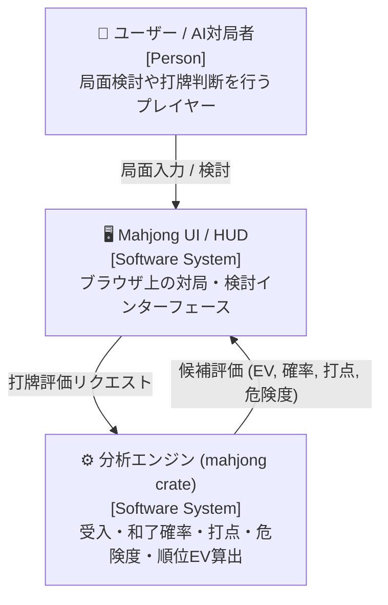
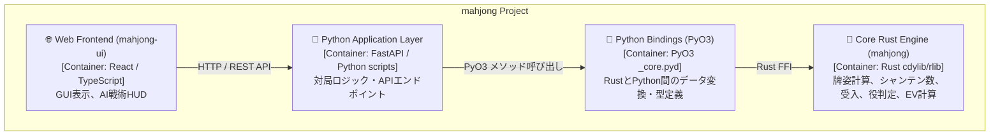
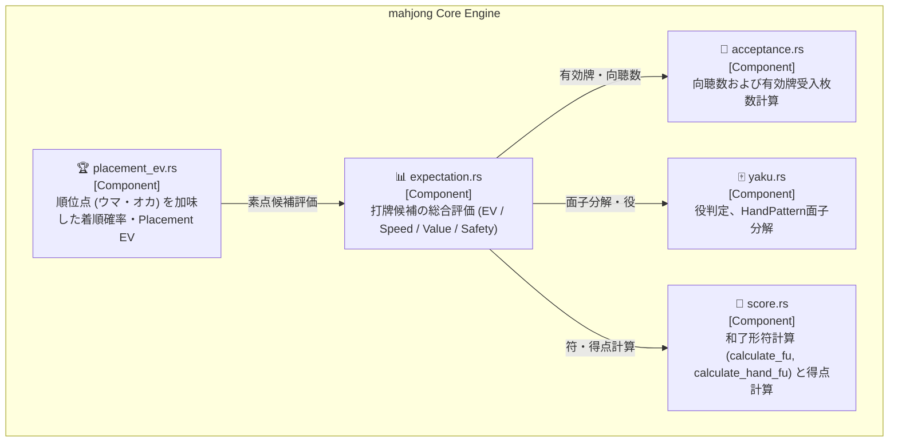
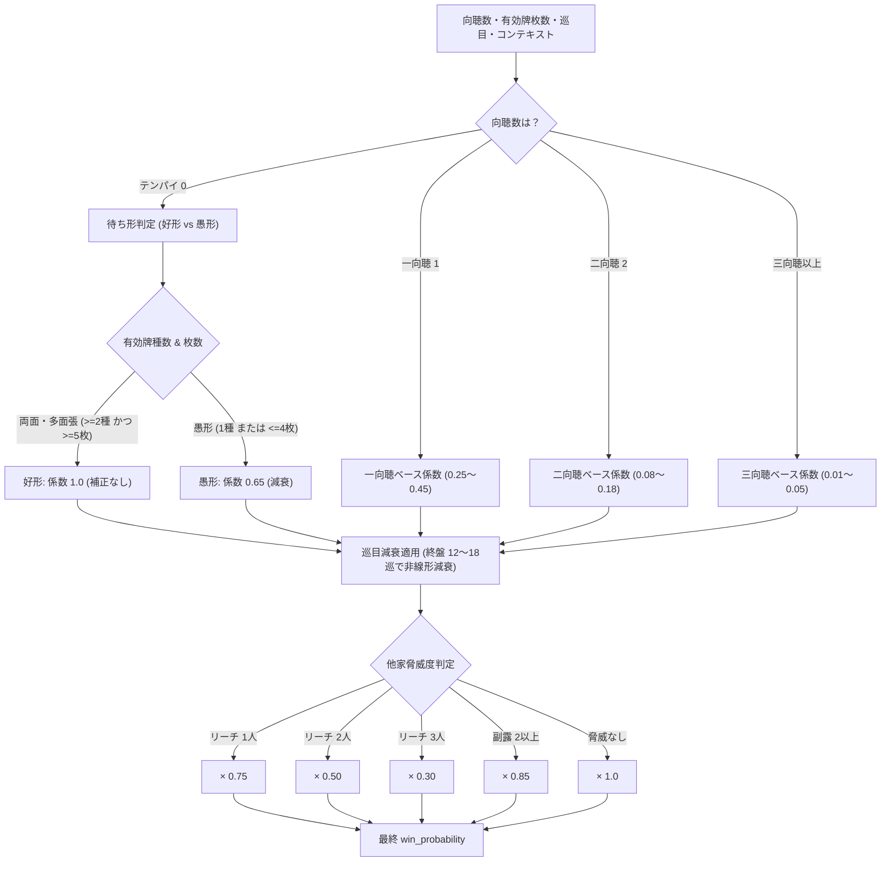

# 設計書: 分析エンジン高度化（C4モデル準拠）

> C4モデル（Context / Container / Component）に準拠した設計書です。  
> 和了確率・正確な符計算・河とスジを反映した危険度・順位失点モデルの詳細設計を定義します。

---

## メタ情報

| 項目 | 値 |
|------|-----|
| プロジェクト名 | mahjong (分析エンジン高度化) |
| バージョン | 1.0.0 |
| 作成日 | 2026-09-14 |
| 最終更新日 | 2026-09-14 |
| 作成者 | Antigravity |

---

## 1. Level 1: システムコンテキスト図（Context Diagram）

### 1.1 説明
本システムは、麻雀対局における手牌・局面情報（巡目、山残り、河、リーチ状況、点況）を入力として、各打牌候補の速度（和了確率）、打点（翻数・符・想定素点）、安全度（危険度スコア）、および総合期待値（素点EV / 順位Placement EV）を高速に算出・評価する分析エンジンである。

### 1.2 コンテキスト図



---

## 2. Level 2: コンテナ図（Container Diagram）

### 2.1 コンテナ図



---

## 3. Level 3: コンポーネント図（Component Diagram）

### 3.1 分析エンジンのコンポーネント構成



---

## 4. 詳細アルゴリズム設計

### 4.1 和了確率推定の動的モデル (`estimate_win_probability`)



#### 4.2 正確な和了形符計算 (`calculate_pattern_fu` & 高点法の適用)

従来の 30 符固定、および枚数カウントのみによる符推定を廃止し、以下のロジックで和了形の符を厳密に計算する：

1. **特殊形**:
   - 七対子: 一律 25 符
   - 門前ピンフツモ: 20 符
2. **通常手（面子分解 `HandPattern` に基づく厳密計算）**:
   - 門前判定（`is_closed`）の共通化: `open_melds.is_empty()` ではなく、`has_open_meld`（`Chii`, `Pon`, `Daiminkan`, `Kakan` の副露有無）で判定。暗槓（`Meld::Ankan`）のみの手牌は完全な門前清として扱い、門前ロン加符 10 符および立直等の門前役を維持。
   - 副底: 20 符
   - 門前ロン加符: 10 符（ツモの場合はツモ符 2 符）
   - 待ち形符（和了牌の面子・雀頭への所属関係判定）:
     - 雀頭単騎: 2 符
     - 順子の嵌張（間待ち）: 2 符
     - 順子の辺張（12に対する3、89に対する7）: 2 符
     - 両面・双ポン: 0 符
   - 雀頭符: 三元牌、自風、場風なら各 2 符（連風牌は 4 符）
   - 面子符:
     - 順子: 0 符（同一牌が複数順子に跨がっていても暗刻加算されない）
     - 刻子: 中張牌暗刻 4 符（明刻 2 符）、ヤオ九牌暗刻 8 符（明刻 4 符）※ロン和了牌で完成した刻子は明刻扱い
     - 槓子: 中張牌暗槓 16 符（明槓 8 符）、ヤオ九牌暗槓 32 符（明槓 16 符）
   - 10 符単位で切り上げ（`ceil10_fu`）、鳴き平和形などの最低符は 30 符。
3. **高点法の適用**:
   - 同一手牌で複数の面子分解（`HandPattern`）が成立する場合（例: 順子取り vs 刻子取り）、それぞれの分解について翻数と符から得点を計算し、**最も高得点となる分解を採用**する。

### 4.3 動的危険度判定 (`evaluate_tile_safety`) および分析対象座席の整合 (`target_player`)

`AnalysisContext` に分析対象座席を示す `target_player: usize`（デフォルト `0`）を保持し、他家の脅威判定・危険度判定・失点計算・打牌EV計算におけるリーチ脅威判定（`has_riichi_threat` / `dealer_riichi`）を一律に `p != target_player` で実施する。
これにより、player_idx = 1, 2, 3 の分析時にも、自身のリーチを他家脅威としてカウントせず、player 0 のリーチ・河・副露を正しく他家脅威として評価する。

他家にリーチ者または高脅威者が存在する場合、河（捨て牌）・見え牌から動的リスクを計算する：

| 判定基準 | 条件 | 危険度スコア (`risk_score`) | 備考 |
|---|---|---|---|
| **現物 (Genbutsu)** | リーチ者の河に捨てられている、またはリーチ宣言牌以降の同巡安全牌 | `0.00` | 振聴規定により完全安全 |
| **字牌 (4枚見え)** | 手牌・河・副露・ドラ表示で4枚すべて見えている | `0.00` | 国士以外放銃不可 |
| **字牌 (3枚見え)** | 3枚見え（残り1枚の地獄単騎のみ） | `0.05` | 極めて安全 |
| **字牌 (2枚見え)** | 2枚見え | `0.12` | 比較的安全 |
| **字牌 (生牌)** | 初見（1枚も見えていない） | `0.35` | 役牌・単騎待ちの危険あり |
| **両スジ中張牌** | 表スジ・裏スジの両方が通っている 4, 5, 6 | `0.15` | シャンポン・単騎のみ |
| **片スジ端牌** | 4が通っているときの 1, 9 | `0.08` | ペンチャン・両面否定 |
| **片スジ 2・8牌** | 5が通っているときの 2, 8 | `0.18` | 両面否定、嵌張・シャンポン残 |
| **片スジ中張牌** | 片方のみスジの 3, 4, 5, 6, 7 | `0.30` | 逆側両面待ちが残る |
| **無筋 1・9牌** | スジが通っていない 1・9 牌 | `0.25` | 愚形・シャンポン |
| **無筋 2・8牌** | スジが通っていない 2・8 牌 | `0.45` | 両面・愚形 |
| **無筋中張牌** | スジが通っていない 3〜7 牌 | `0.75` | 本線両面待ちの超危険牌 |

※ 公開 Python API および CLI サンプルゲームループにおいて、各家のリーチ・河・副露・親情報を `AnalysisContext` に完全バインドし、単一の計算源とする。

### 4.4 順位期待値（Placement EV）の動的失点モデル (`estimate_deal_loss`)

```rust
pub fn estimate_deal_loss(
    match_ctx: &MatchContext,
    analysis_ctx: &AnalysisContext,
    player_idx: usize,
) -> i32 {
    // 1. 全リーチ者を走査し、親リーチが含まれているかを判定（最大失点リスク優先）
    let riichi_opponents: Vec<usize> = (0..4)
        .filter(|&p| p != player_idx && analysis_ctx.riichi_status[p])
        .collect();

    let has_dealer_riichi = riichi_opponents.iter().any(|&p| {
        p == match_ctx.dealer_idx || analysis_ctx.player_is_dealer[p]
    });

    let has_any_riichi = !riichi_opponents.is_empty();

    let base_points = if has_dealer_riichi {
        12000 // 親リーチ: 12,000点 (親満貫〜跳満基準)
    } else if has_any_riichi {
        8000  // 子リーチ: 8,000点 (子満貫基準)
    } else if match_ctx.dealer_idx != player_idx {
        9600  // 親の仕掛け・平時
    } else {
        5200  // 子の仕掛け・平時
    };

    base_points + (match_ctx.honba as i32) * 300
}
```

---

## 5. インターフェース設計（`AnalysisContext` 拡張）

```rust
pub struct AnalysisContext<'a> {
    pub turn_number: usize,
    pub remaining_wall_tiles: usize,
    pub seat_wind: Option<TileName>,
    pub round_wind: Option<TileName>,
    pub dora_indicators: &'a [TileName],
    pub is_dealer: bool,
    // 追加フィールド（デフォルト実装あり）
    pub riichi_status: [bool; 4],
    pub player_rivers: &'a [&'a [TileName]],
    pub player_melds: &'a [&'a [crate::hand::Meld]],
    pub player_is_dealer: [bool; 4],
}
```

---

## 6. 変更履歴

| バージョン | 日付 | 変更内容 | 変更者 |
|-----------|------|---------|--------|
| 1.0.0 | 2026-09-14 | 初版作成 | Antigravity |
