# 基本・詳細設計書: Python API (PyO3) 境界でのシリアライズ・中間オブジェクト削減 & 順位点計算最適化

> 本設計書は、Issue #106 の解決に向けた `placement_ev.rs` および `python_api.rs` の詳細アーキテクチャ・データフロー設計です。

---

## メタ情報

| 項目 | 値 |
|------|-----|
| プロジェクト名 | mahjong |
| 機能名 | Python API シリアライズ最適化 & Placement EV 最適化（Issue #106） |
| バージョン | 1.0.0 |
| 作成日 | 2026-09-17 |
| 最終更新日 | 2026-09-17 |
| 作成者 | Antigravity AI |
| ステータス | Review |

---

## 1. システム構成・アーキテクチャ

### 1.1 改善前のデータフロー（課題）

```mermaid
flowchart TD
    subgraph Rust ["Rust: placement_ev.rs"]
        E["evaluate_hand_discards_with_placement"]
        E -->|候補ごとに3回呼出| ERP["estimate_rank_probabilities"]
        ERP -->|毎回 Vec::new + sort| OS["Vec<i32> (他家3名)"]
    end

    subgraph PyO3_Before ["PyO3: py_get_ai_hud_data (従来)"]
        HUD["py_get_ai_hud_data"]
        HUD --> CallEval["py_evaluate_placement_discards"]
        CallEval --> PyClassList["Vec<PyPlacementEvaluation> (中間PyClass)"]
        PyClassList --> ToDictLoop["e.to_dict(py) ループ"]
        ToDictLoop --> PyDictRes["PyDict (candidates)"]
    end
```



### 1.2 改善後のデータフロー

```mermaid
flowchart TD
    subgraph Rust_Optimized ["Rust: placement_ev.rs"]
        PreSort["評価開始時に他家スコアを抽出・ソート: [i32; 3]"]
        E_opt["evaluate_hand_discards_with_placement"]
        PreSort --> E_opt
        E_opt -->|参照渡し &[i32; 3]| ERP_opt["estimate_rank_probabilities (ゼロアロケーション)"]
    end

    subgraph PyO3_Optimized ["PyO3: python_api.rs"]
        InternalHelper["evaluate_placement_discards_internal\n(入力検証・Context構築・Rust評価)"]
        InternalHelper -->|(MatchContext, Vec<PlacementCandidateEvaluation>)| DirectPath
        
        subgraph DirectPath ["直接 PyDict / PyList 構築"]
            HUD_opt["py_get_ai_hud_data"]
            DirectDict["各 Candidate から直接 PyDict 作成 (中間 PyClass 生成ゼロ)"]
            HUD_opt --> DirectDict
        end

        subgraph LegacyPath ["公開 API 互換レイヤー"]
            EvalPl["py_evaluate_placement_discards"]
            EvalPl -->|従来通りの戻り値| PyClassVec["Vec<PyPlacementEvaluation>"]
        end
    end
```

---

## 2. モジュール別詳細設計

### 2.1 `placement_ev.rs` の最適化

#### 変更前
```rust
fn estimate_rank_probabilities(
    ctx: &MatchContext,
    player_idx: usize,
    my_predicted_score: i32,
) -> [f64; 4] {
    let mut other_scores = Vec::new();
    for p in 0..4 {
        if p != player_idx {
            other_scores.push(ctx.scores[p]);
        }
    }
    other_scores.sort_by(|a, b| b.cmp(a)); // 降順
    ...
```

#### 変更後
```rust
/// 局後スコアから着順確率（1位〜4位）をロジスティック近似で推定（事前ソート済み配列版）
#[inline]
fn estimate_rank_probabilities(
    sorted_other_scores: &[i32; 3],
    my_predicted_score: i32,
) -> [f64; 4] {
    let win_vs = |s_my: i32, s_other: i32| -> f64 {
        let diff = (s_my - s_other) as f64;
        1.0 / (1.0 + (-diff / 5000.0).exp())
    };

    let p_vs_0 = win_vs(my_predicted_score, sorted_other_scores[0]);
    let p_vs_1 = win_vs(my_predicted_score, sorted_other_scores[1]);
    let p_vs_2 = win_vs(my_predicted_score, sorted_other_scores[2]);

    let p_1st = (p_vs_0 * p_vs_1 * p_vs_2).clamp(0.01, 0.97);
    let p_4th = ((1.0 - p_vs_0) * (1.0 - p_vs_1) * (1.0 - p_vs_2)).clamp(0.01, 0.97);
    let remaining = (1.0 - p_1st - p_4th).max(0.02);
    let p_2nd = remaining * (p_vs_1 / (p_vs_1 + (1.0 - p_vs_1)).max(0.01));
    let p_3rd = remaining - p_2nd;

    [p_1st, p_2nd, p_3rd, p_4th]
}
```

`evaluate_hand_discards_with_placement` の先頭で：
```rust
let mut sorted_other_scores = [0i32; 3];
let mut idx = 0;
for p in 0..4 {
    if p != player_idx {
        sorted_other_scores[idx] = match_ctx.scores[p];
        idx += 1;
    }
}
sorted_other_scores.sort_by(|a, b| b.cmp(a)); // 降順
```
これを各シナリオ判定（`probs_win`, `probs_deal`, `probs_other`）で渡す。

### 2.2 `python_api.rs` の最適化

#### 内部共通ヘルパーの定義
```rust
pub(crate) fn evaluate_placement_discards_internal(
    py: Python<'_>,
    tiles: Vec<PyTileName>,
    match_context: &PyMatchContext,
    player_idx: usize,
    is_dealer: Option<bool>,
    dora_indicators: Option<Vec<PyTileName>>,
    turn_number: Option<usize>,
    remaining_wall_tiles: Option<usize>,
    seat_wind: Option<PyTileName>,
    visible_tiles: Option<Vec<PyTileName>>,
    riichi_status: Option<[bool; 4]>,
    player_rivers: Option<Vec<Vec<PyTileName>>>,
    player_melds: Option<Vec<Vec<PyMeld>>>,
    player_is_dealer: Option<[bool; 4]>,
) -> PyResult<(MatchContext, Vec<PlacementCandidateEvaluation>)> {
    if player_idx >= 4 {
        return Err(PyValueError::new_err("player_idx must be in range 0..4"));
    }
    if match_context.dealer_idx >= 4 {
        return Err(PyValueError::new_err("dealer_idx must be in range 0..4"));
    }
    // Hand, AnalysisContext, MatchContext, visible_opt の構築
    ...
    let rs_match: MatchContext = match_context.into();
    let evs = py.allow_threads(|| {
        evaluate_hand_discards_with_placement(&hand, visible_opt, &ctx, &rs_match, player_idx)
    });
    Ok((rs_match, evs))
}
```

#### `py_get_ai_hud_data` での直接変換
```rust
let (rs_match, evs) = evaluate_placement_discards_internal(...)?;
let dict = PyDict::new(py);
...
let cand_list = PyList::empty(py);
for e in &evs {
    let c_dict = PyDict::new(py);
    let py_tile: PyTileName = e.base.discard_tile.into();
    c_dict.set_item("discard_tile", py_tile.as_str())?;
    c_dict.set_item("mpsz", py_tile.mpsz())?;
    c_dict.set_item("raw_ev", e.base.ev)?;
    c_dict.set_item("placement_ev", e.placement_ev)?;
    c_dict.set_item("expected_rank", e.expected_rank)?;
    c_dict.set_item("rank_probabilities", e.rank_probabilities.to_vec())?;
    c_dict.set_item("situational_note", &e.situational_note)?;
    c_dict.set_item("shanten_after", e.base.shanten_after)?;
    let rem: usize = e.base.acceptance.iter().map(|a| a.count).sum();
    c_dict.set_item("remaining_count", rem)?;
    c_dict.set_item("expected_score", e.base.value.expected_score)?;
    c_dict.set_item("risk_score", e.base.safety.risk_score)?;
    c_dict.set_item("is_safe", e.base.safety.is_safe)?;
    cand_list.append(c_dict)?;
}
dict.set_item("candidates", cand_list)?;
```

オーラス条件（`orasu_conditions`）についても、`calculate_orasu_conditions` を直接呼び、`Vec<PyWinCondition>` を経由せず直接 `PyDict` に構築する。

---

## 3. テスト設計

1. **同値性テスト (`tests/test_placement_ev.rs`)**:
   - `estimate_rank_probabilities` の旧ロジック相当と新ロジックで同一スコアを与えた際の `[f64; 4]` 配列同値性検証。
2. **HUD API キー・値完全一致テスト (`tests_python/test_ui_api.py`)**:
   - 既存の `test_placement_evaluation_and_hud_data` に加え、オーラス時・平場時での全キー・型の存在検証および不正入力（`player_idx = 4`, `dealer_idx = 4`）での例外一致検証。
3. **ベンチマーク (`benches/python_api_benchmark.rs`)**:
   - `py_get_ai_hud_data` の複数打牌候補（14枚）・オーラス局面ベンチマークを追加。
