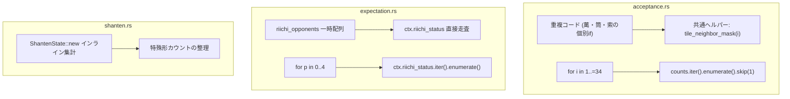

# 設計書: コードベースのリファクタリング及びコード品質改善

---

## 1. 変更アーキテクチャ



---

## 2. 詳細設計

### 2.1 `acceptance.rs` のリファクタリング
- **周辺牌マスク生成**:
  ```rust
  #[inline(always)]
  fn tile_neighbor_mask(tile_idx: usize) -> u64 {
      if tile_idx <= 27 {
          // 数牌: スーツ内の開始・終了インデックスを計算
          let suit_start = ((tile_idx - 1) / 9) * 9 + 1;
          let suit_end = suit_start + 8;
          let low = tile_idx.saturating_sub(2).max(suit_start);
          let high = (tile_idx + 2).min(suit_end);
          let mut mask = 0u64;
          for idx in low..=high {
              mask |= 1u64 << idx;
          }
          mask
      } else {
          // 字牌
          1u64 << tile_idx
      }
  }
  ```
- **イテレータ化**:
  `for (i, &c) in counts.iter().enumerate().take(35).skip(1)` によりインデックス直接アクセスの range loop を排除。

### 2.2 `expectation.rs` のリファクタリング
- **中間配列の排除**:
  ```rust
  let mut genbutsu_all_mask = !0u64;
  let mut genbutsu_any_mask = 0u64;
  let mut riichi_river_ranks = [0u16; 3];
  let mut riichi_player_count = 0;

  for (p, &is_riichi) in ctx.riichi_status.iter().enumerate() {
      if p == ctx.target_player || !is_riichi {
          continue;
      }
      riichi_player_count += 1;
      if let Some(river) = ctx.player_rivers.get(p) {
          // 河の集計
      }
  }
  ```
  一時配列 `[false; 4]` への書き込みと2重ループを廃止し、1パスで安全度特徴量を構築。