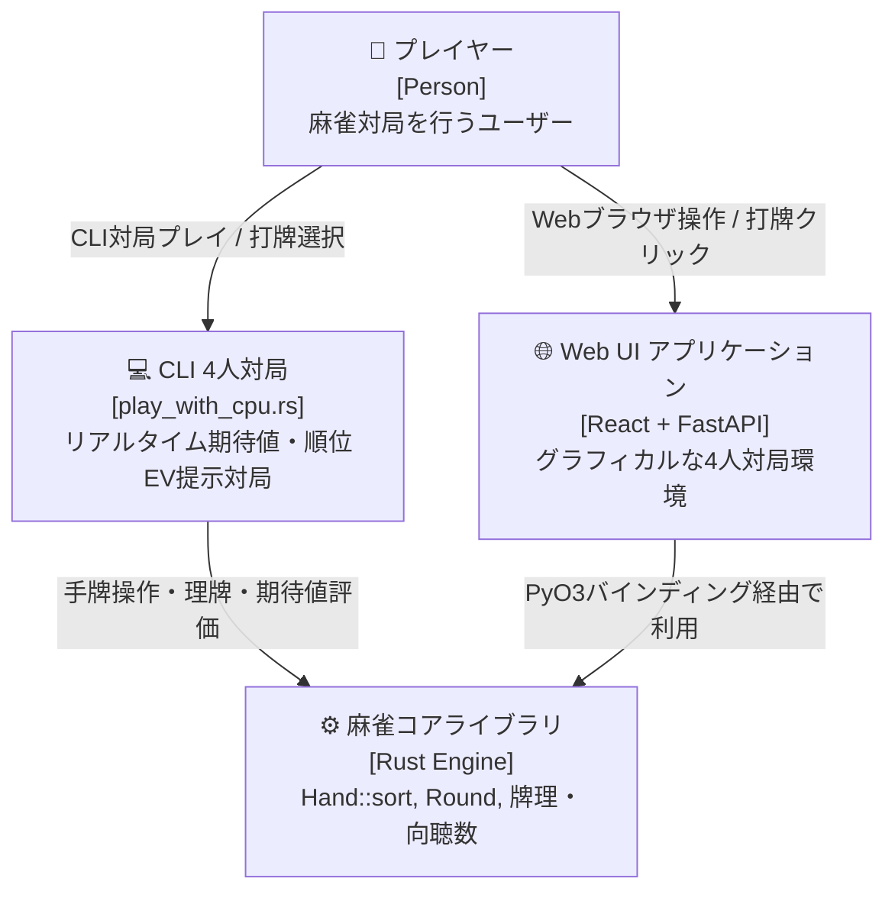
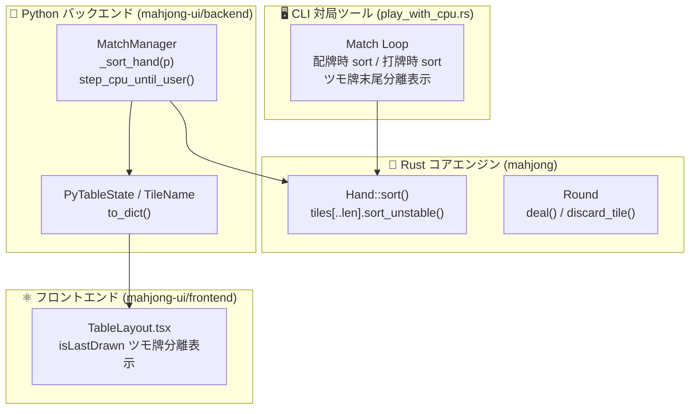

# 設計書：コンピュータ対局（CPU対局）手牌の理牌（ソート）

> C4モデル（Context / Container / Component）準拠  
> 本設計書は、参照専用の definition/templates/design.md に基づき作成されています。

---

## メタ情報

| 項目 | 値 |
|------|-----|
| プロジェクト名 | mahjong-cpu-match-hand-sorting |
| バージョン | 1.0.0 |
| 作成日 | 2026-09-14 |
| 最終更新日 | 2026-09-14 |
| 作成者 | Syun & AI Assistant |

---

## 1. Level 1: システムコンテキスト図（Context Diagram）

### 1.1 説明
本システムは、ユーザーがCLIまたはWebブラウザを通じて4人コンピュータ対局（CPU対局）をプレイする際、配牌時、ツモ・打牌進行時、および終局開帳時において手牌を自動的に昇順整列（理牌）する機構を提供します。

### 1.2 コンテキスト図



---

## 2. Level 2: コンテナ図（Container Diagram）

### 2.1 説明
麻雀対局の手牌理牌は、Rust製コアエンジン、CLI実行バイナリ、およびPython/FastAPIバックエンド（`MatchManager`）の各コンテナ層で協調して実行されます。

### 2.2 コンテナ図



---

## 3. Level 3: コンポーネント図（Component Diagram）

### 3.1 CLI 対局 (`play_with_cpu.rs`) の手牌ライフサイクル

```mermaid
flowchart TD
    A[局開始: 配牌 13枚] --> B[for hand in &mut hands { hand.sort(); }]
    B --> C{現在手番}

    C -->|自家手番| D[ツモ: hand.push(drawn)]
    D --> E["純手牌13枚[0..13](ソート済) + ツモ牌[13](末尾)<br/>画面表示: あなたの手牌: [1:1m]...[13:9s] ツモ: [14:5p]"]
    E --> F[打牌選択・hand.discard(idx)]
    F --> G["残手牌13枚を再理牌: hand.sort()"]

    C -->|CPU手番| H[CPUツモ: hand.push(drawn)]
    H --> I[AI打牌決定・hand.discard(idx)]
    I --> J["CPU残手牌を再理牌: hand.sort()"]

    G --> K{和了 / 流局 / 次巡}
    J --> K
    K -->|終局開帳| L[全プレイヤーの手牌表示: 綺麗に整列]
```

### 3.2 Web UI (`match_manager.py`) の `_sort_hand` 実装詳細

```python
def _sort_hand(self, player_idx: int) -> None:
    """Sorts a player's hand by tile order."""
    def tile_key(t: TileName) -> int:
        try:
            return ALL_TILES.index(t)
        except ValueError:
            return 999
    self.hands[player_idx].sort(key=tile_key)
```

- 配牌完了時（13枚配布後）：
  - `for p in range(4): self._sort_hand(p)`
- 自家打牌完了後（`user_discard`）：
  - `self.hands[0].pop(tile_index)`
  - `self._sort_hand(0)`
- CPU打牌完了後（`_choose_cpu_discard`）：
  - CPU手牌から打牌を除去後、`self._sort_hand(p)`
- 自家ツモ時（`step_cpu_until_user` または親の局開始時）：
  - ソート済みの純手牌（13枚）の末尾に `drawn` を `self.hands[0].append(drawn)`
  - これによりフロントエンド `TableLayout.tsx` の `isLastDrawn = idx === human.hand_mpsz.length - 1 && human.hand_mpsz.length % 3 === 2` と完全整合。

### 3.3 コアライブラリ (`round.rs`) の実装詳細

- `Round::sort_hand(&mut self, player_index: usize)`:
  - 指定したプレイヤーの手牌（`self.hands[player_index]`）を理牌（昇順ソート）するメソッドを提供。低レベルシミュレーションの決定論的ツモ・捨て牌順序を保ちつつ、必要に応じた手牌整列を可能にします。
