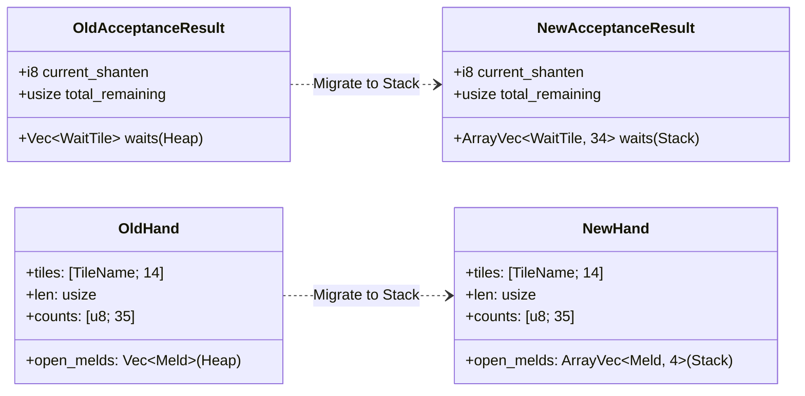
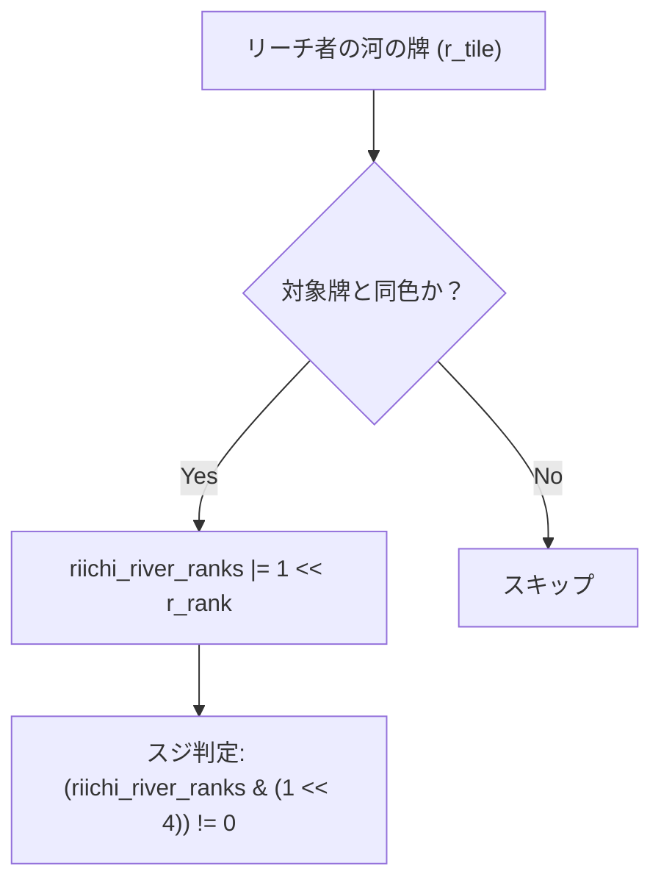

# 設計書: ホットパスのヒープ割り当て排除（Vec → ArrayVec / ビットマスク）

> IEEE 1016 をベースにした軽量版ソフトウェア設計書です。  
> 要件定義書: `docs/requirements/eliminate-hotpath-heap-allocations.md` に対応します。

---

## メタ情報

| 項目 | 値 |
|------|-----|
| プロジェクト名 | mahjong |
| 機能名 | ホットパスのヒープ割り当て排除 |
| バージョン | 1.0.0 |
| 作成日 | 2026-09-15 |
| 最終更新日 | 2026-09-15 |
| 作成者 | Antigravity AI |
| ステータス | Review |

---

## 1. 全体アーキテクチャ・設計方針

### 1.1 背景と設計目標

麻雀の各局において、打牌候補評価（最大14枚の候補牌×巡目）および副露アドバイザー（チー・ポン・スルーの全分岐評価）はホットパスとして並列・直列を問わず数万回実行されます。
従来の設計では、コレクションのサイズ上限がドメイン知識上固定であるにもかかわらず、汎用的な `Vec<T>` が多用されていました。

本設計では、固定サイズ配列を内包してスタック上で完結する `ArrayVec` と、スカラ整数（`u16`）を用いたビットマスクを適用し、ヒープ割り当てオーバーヘッドとキャッシュミスを完全排除します。

### 1.2 構造変化概要



---

## 2. 詳細コンポーネント設計

### 2.1 スジ判定のビットマスク化 (`src/mahjong/expectation.rs`)

#### 2.1.1 課題と解決策
- **従来**: リーチ者の河にある同色牌のランクを `Vec::new()` に追加し、`riichi_river_ranks.contains(&4)` 等で線形検索。
- **改善**: `u16` の 1〜9 ビット目をランクに対応させたビットマスク `riichi_river_ranks: u16` を使用。



#### 2.1.2 ビット演算設計
```rust
let mut riichi_river_ranks = 0u16;
for p in 0..4 {
    if p != ctx.target_player && ctx.riichi_status[p] {
        if let Some(river) = ctx.player_rivers.get(p) {
            for &r_tile in *river {
                let r_idx = r_tile as usize;
                let (r_suit, r_rank) = if (1..=9).contains(&r_idx) {
                    (0, r_idx)
                } else if (10..=18).contains(&r_idx) {
                    (1, r_idx - 9)
                } else if (19..=27).contains(&r_idx) {
                    (2, r_idx - 18)
                } else {
                    (99, 99)
                };
                if r_suit == suit {
                    riichi_river_ranks |= 1 << r_rank;
                }
            }
        }
    }
}

let has_rank = |r: usize| (riichi_river_ranks & (1 << r)) != 0;
```

### 2.2 有効牌集計 `AcceptanceResult` の最適化 (`src/mahjong/acceptance.rs`)

有効牌（待ち牌）は全34種（萬子9種+筒子9種+索子9種+字牌7種）を超えることは原理的にありません。
したがって、`ArrayVec<WaitTile, 34>` を採用します。

```rust
#[derive(Debug, Clone, PartialEq, Eq)]
pub struct AcceptanceResult {
    pub current_shanten: i8,
    pub waits: ArrayVec<WaitTile, 34>,
    pub total_remaining: usize,
    pub tile_types_count: usize,
}
```

- `calculate_acceptance()` 内で `let mut waits = ArrayVec::<WaitTile, 34>::new();` とし、`waits.push(WaitTile { ... })` を実行。

### 2.3 手牌 `Hand.open_melds` の最適化 (`src/mahjong/hand.rs`)

麻雀のルール上、1手牌に含まれる副露（チー、ポン、カン）の最大数は4組です。
`ArrayVec<Meld, 4>` を採用することにより、`Hand` 構造体全体がヒープへのポインタを持たなくなります。

```rust
#[derive(Clone, Debug)]
pub struct Hand {
    tiles: [TileName; 14],
    len: usize,
    pub open_melds: ArrayVec<Meld, 4>,
    pub counts: [u8; 35],
}
```

- `Hand::new()` で `open_melds: ArrayVec::new()`。
- `call_meld()` での上限チェック：
  ```rust
  if self.open_melds.len() >= 4 {
      return Err("Cannot have more than 4 melds");
  }
  ```
- **波及効果**: `call_advisor.rs` において `let mut post_hand = hand.clone();` が実行された際、従来のヒープ再割り当てが完全に不要となり、単一のメモリコピー（memcpy）で完結。

### 2.4 評価指標構造体の最適化 (`src/mahjong/expectation.rs`)

```rust
#[derive(Debug, Clone, PartialEq)]
pub struct SpeedMetric {
    pub accepted_tiles: ArrayVec<TileName, 34>,
    pub remaining_count: usize,
    pub win_probability: f64,
}

#[derive(Debug, Clone, PartialEq)]
pub struct ValueMetric {
    pub expected_score: f64,
    pub expected_han: f64,
    pub primary_yaku: ArrayVec<&'static str, 10>,
    pub has_high_value_potential: bool,
}
```

- `SpeedMetric.accepted_tiles`: `acceptance.waits.iter().map(|w| w.tile).collect()` により直接 `ArrayVec` へ構築。
- `ValueMetric.primary_yaku`: 主要役（立直、平和、断么九など）の名称を保持。最大10種で十分であり、`ArrayVec::<&'static str, 10>::new()` を用いる。

---

## 3. 依存関係と影響範囲

### 3.1 依存ライブラリ
- `Cargo.toml` に `arrayvec = "0.7"` を追加。

### 3.2 影響ファイル
1. `Cargo.toml`: 依存関係追加
2. `src/mahjong/acceptance.rs`: `AcceptanceResult` 変更
3. `src/mahjong/hand.rs`: `Hand.open_melds` 変更
4. `src/mahjong/expectation.rs`: `SpeedMetric`, `ValueMetric`, `evaluate_tile_safety` 変更
5. `src/mahjong/call_advisor.rs`: クローン高速化
6. `src/mahjong/explanation.rs`: 単体テスト内のモック構造体構築の修正
7. `src/mahjong/review.rs`: 単体テスト内のモック構造体構築の修正
8. `src/python_api.rs`: `From<&PyCandidateEvaluation>` の構築部修正
