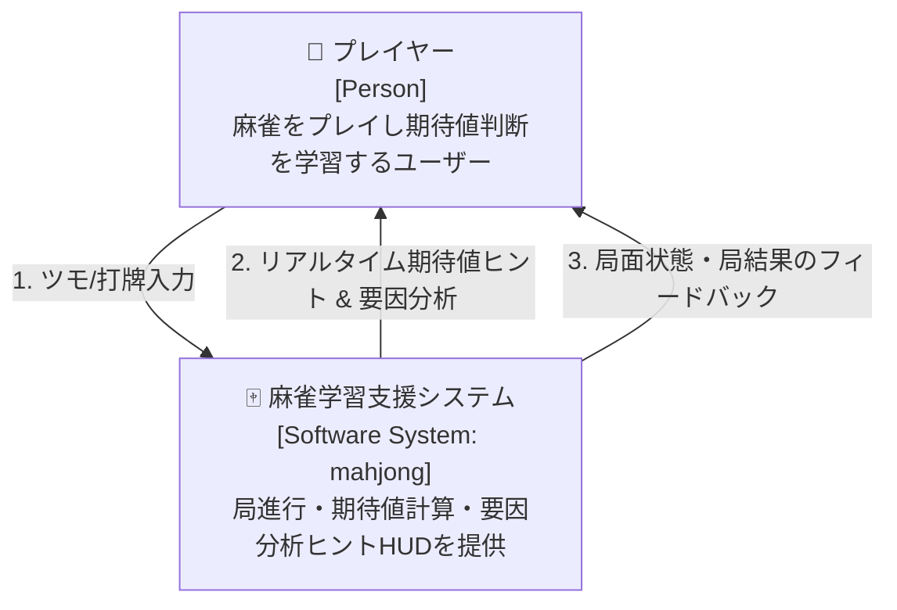
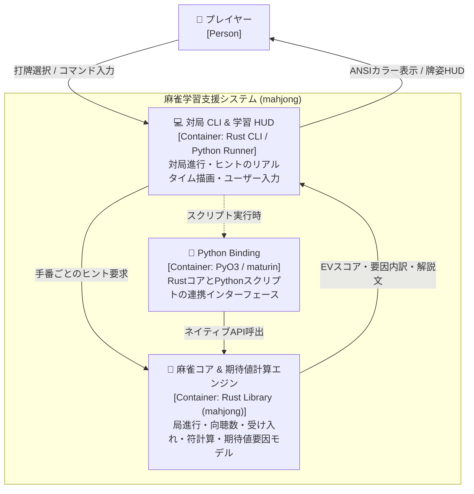
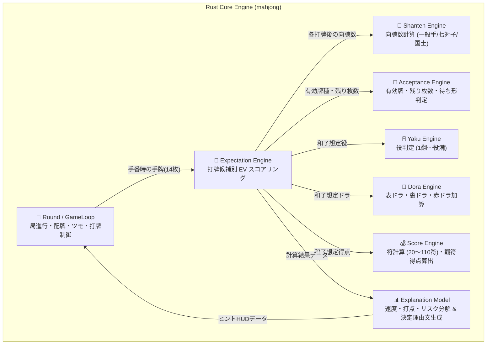
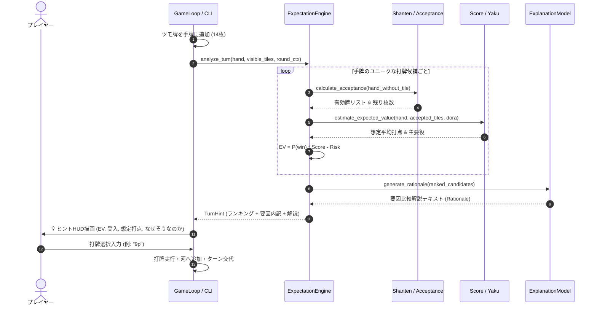
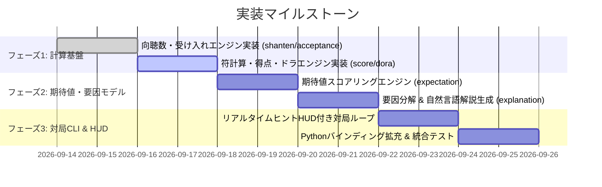

# 基本・詳細設計書：リアルタイム期待値ヒント＆意思決定モデル学習ツール

> C4モデル（Context / Container / Component）準拠  
> 本設計書は、参照専用の `definition/templates/design.md` に基づき作成されています。

---

## メタ情報

| 項目 | 値 |
|------|-----|
| プロジェクト名 | mahjong-learning-assistant |
| バージョン | 1.0.0 |
| 作成日 | 2026-09-13 |
| 最終更新日 | 2026-09-13 |
| 作成者 | Syun & AI Assistant |

---

## 1. Level 1: システムコンテキスト図（Context Diagram）

### 1.1 説明
プレイヤーが麻雀の対局（一人麻雀・練習対戦）をプレイする中で、プレイヤーの手番（ツモ直後）にリアルタイムで打牌期待値（EV）ランキングおよび要因分解モデル（速度・打点・守備）を提示する学習システムです。

### 1.2 コンテキスト図



---

## 2. Level 2: コンテナ図（Container Diagram）

### 2.1 コンテナ図



### 2.2 コンテナ一覧

| コンテナ名 | 技術スタック | 責務 | 通信プロトコル |
|-----------|------------|------|--------------|
| **Rust Core** | Rust 2021 (cdylib/rlib) | 牌・手牌・局進行・向聴数・符計算・期待値・要因分析の超高速計算 | インメモリ関数呼出 |
| **Python Binding** | PyO3, maturin | Python 側から Rust 計算エンジンを呼び出すためのバインディング層 | C-FFI / Python C-API |
| **対局 CLI & HUD** | Rust / Python | 局面のターミナル表示、手番時ヒントHUD、打牌受付 | 標準入出力 (stdin/stdout) |

---

## 3. Level 3: コンポーネント図（Component Diagram: Rust Core）

### 3.1 コンポーネント図



### 3.2 主要コンポーネント詳細

| コンポーネント | ソースファイル | 主な責務とアルゴリズム |
| :--- | :--- | :--- |
| **向聴数エンジン** | `src/mahjong/shanten.rs` | 面子手（バックトラック/深さ優先探索）、七対子（対子数と種類）、国士無双（19字牌の種類と対子）の最小向聴数を計算。 |
| **有効牌エンジン** | `src/mahjong/acceptance.rs` | 手牌から各牌を切った後、全34種の牌を1枚加えたときの向聴数を走査。向聴数が下がる牌を「有効牌」としてリストアップし、見えている牌を引いて残り枚数を集計。 |
| **符・得点エンジン** | `src/mahjong/score.rs` | 和了時の手牌構成（面子の明暗・公九、雀頭役牌、待ち形符）から符を10符単位で切り上げ計算。翻数と組み合わせて子・親のツモ/ロン得点を算出。 |
| **ドラエンジン** | `src/mahjong/dora.rs` | ドラ表示牌の次の牌（ネクスト牌）判定、赤ドラ判定（赤5m/5p/5s）と翻数合算。 |
| **期待値エンジン** | `src/mahjong/expectation.rs` | 各打牌候補の $EV = P(\text{和了}) \times \text{平均和了打点} - P(\text{放銃}) \times \text{平均放銃失点}$ を算出。 |
| **要因分解モデル** | `src/mahjong/explanation.rs` | EV上位候補同士の速度（枚数差）・打点（満貫変化等）・安全度を比較し、「なぜ1位が最善か」の日本語解説テキストを生成。 |

---

## 4. データ構造・モデル設計

### 4.1 期待値ヒント＆要因モデル構造体

```rust
/// 各打牌候補の評価結果
pub struct DiscardCandidateEvaluation {
    pub discard_tile: TileName,        // 切る牌
    pub shanten_after: i8,             // 打牌後の向聴数 (0: テンパイ, 1: 一向聴...)
    pub ev: f64,                       // 総合期待値スコア
    
    // 要因分解モデル (Explanatory Breakdown)
    pub speed: SpeedMetric,            // 速度指標
    pub value: ValueMetric,            // 打点指標
    pub safety: SafetyMetric,          // 安全度指標
}

/// 速度指標
pub struct SpeedMetric {
    pub accepted_tiles: Vec<TileName>, // 受け入れ牌一覧
    pub remaining_count: usize,        // 残り受け入れ合計枚数
    pub win_probability: f64,          // 想定和了確率 (0.0 ~ 1.0)
}

/// 打点指標
pub struct ValueMetric {
    pub expected_score: f64,           // 平均和了打点
    pub expected_han: f64,             // 平均翻数
    pub primary_yaku: Vec<&'static str>,// 想定される主要役 (タンヤオ, 平和, 三色等)
    pub has_high_value_potential: bool,// 打点アップ変化があるか
}

/// 安全度指標
pub struct SafetyMetric {
    pub risk_score: f64,               // 危険度スコア (0.0: 現物安全 ~ 1.0: 超危険)
    pub is_genbutsu: bool,             // 他家への現物か
}

/// ヒントHUD全体出力
pub struct TurnHint {
    pub candidates: Vec<DiscardCandidateEvaluation>, // 期待値順ランキング
    pub best_discard: TileName,                      // 推奨打牌
    pub rationale: String,                           // なぜその打牌なのかの解説文
}
```

---

## 5. 主要シーケンス図（手番時のヒント生成フロー）



---

## 6. 実装タスク計画（マイルストーン）


