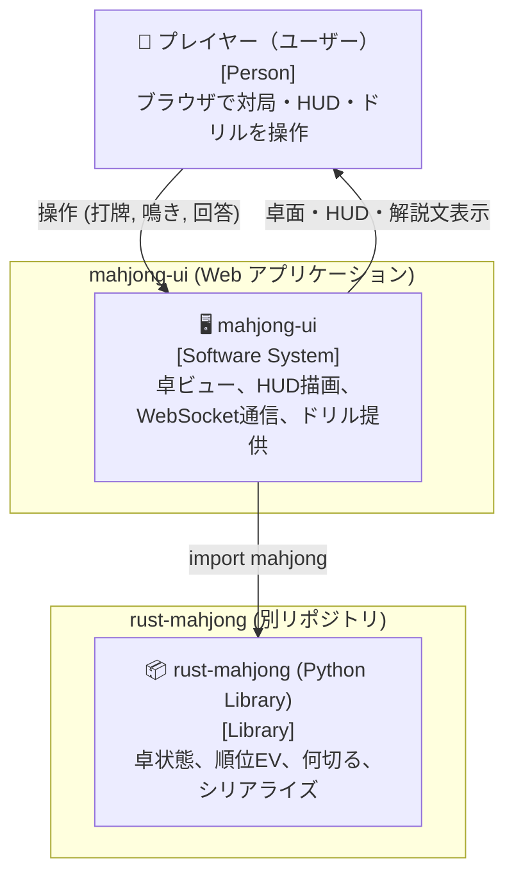
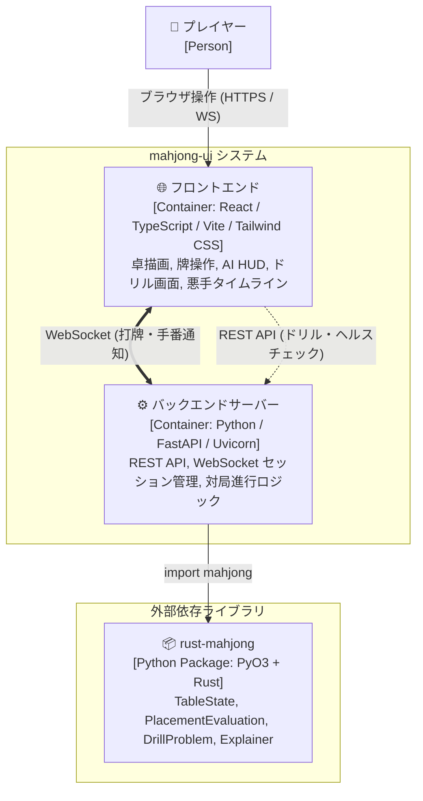
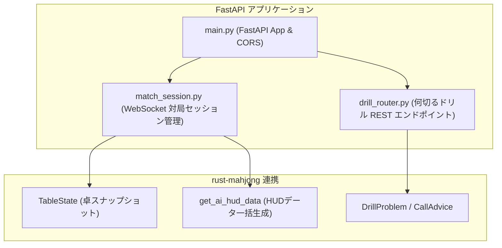
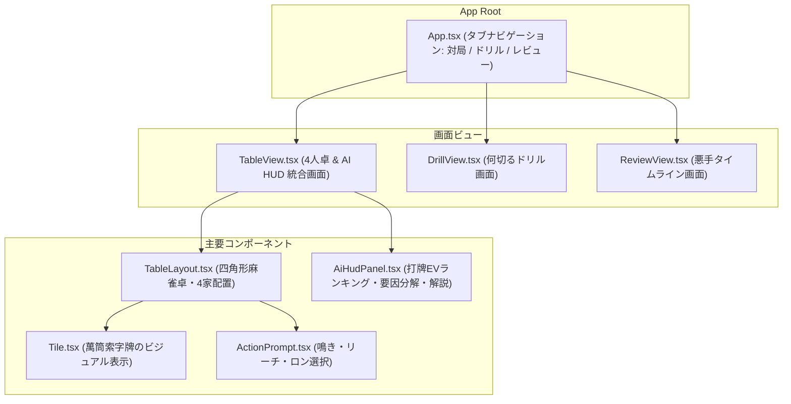

# 設計書：麻雀AI学習プラットフォーム Web UI アプリケーション (`mahjong-ui`)

> C4モデル（Context / Container / Component）準拠  
> 本設計書は、参照専用の `definition/templates/design.md` のテンプレートに基づき作成されています。

---

## メタ情報

| 項目 | 値 |
|------|-----|
| プロジェクト名 | mahjong-ui |
| モジュール名 | mahjong-ui (麻雀AI学習 Web/GUI アプリケーション) |
| バージョン | 1.0.0 |
| 作成日 | 2026-09-14 |
| 最終更新日 | 2026-09-14 |
| 作成者 | Syun & AI Assistant |
| ステータス | Review |

---

## 1. Level 1: システムコンテキスト図（Context Diagram）

### 1.1 説明
`mahjong-ui` は、プレイヤーがブラウザ上で麻雀対局、AI HUD によるリアルタイム指導、何切るドリル学習を行うためのフルスタック Web アプリケーションです。  
基盤となる麻雀数理・ルール判定・AI評価・シリアライズには、別リポジトリの Python ライブラリ `rust-mahjong` を使用します。

### 1.2 コンテキスト図



---

## 2. Level 2: コンテナ図（Container Diagram）

### 2.1 コンテナ図



### 2.2 コンテナ一覧

| コンテナ名 | 技術スタック | 責務 | 通信プロトコル |
|-----------|------------|------|--------------|
| フロントエンド | React 18, TypeScript, Vite, Tailwind CSS, Lucide Icons | 4人卓描画、牌操作、AI HUDパネル、ドリルUI、悪手レビュー | HTTP / WebSocket |
| バックエンド | Python 3.10+, FastAPI, Uvicorn, WebSockets | 対局セッション制御、CPU思考委譲、REST/WSエンドポイント | In-process (Python) |
| コアライブラリ | `rust-mahjong` (PyO3) | 牌理、点数計算、順位期待値、ドリル問題生成、辞書シリアライズ | C-API / PyO3 |

---

## 3. Level 3: コンポーネント図（Component Diagram）

### 3.1 バックエンド構成 (`backend/`)



### 3.2 フロントエンド構成 (`frontend/src/`)



---

## 4. ディレクトリ構成設計

```
mahjong-ui/
├── backend/
│   ├── pyproject.toml         # FastAPI, uvicorn, websockets, rust-mahjong
│   ├── main.py                # FastAPI エントリーポイント
│   ├── match_manager.py       # 4人CPU対局進行・状態マシン
│   └── routers/
│       ├── match.py           # WebSocket /ws/match
│       └── drill.py           # REST /api/drill/*
├── frontend/
│   ├── package.json           # React, Vite, Tailwind CSS, TypeScript
│   ├── vite.config.ts
│   ├── index.html
│   └── src/
│       ├── App.tsx            # メイン画面（タブ切替）
│       ├── components/
│       │   ├── Table/         # 麻雀卓・手牌・河・アクション
│       │   ├── HUD/           # AI HUD パネル・要因分解カード
│       │   ├── Drill/         # 何切るドリル
│       │   └── Common/        # 牌描画 (Tile.tsx)
│       ├── services/          # API & WebSocket クライアント
│       └── types/             # TypeScript 型定義 (TableState, HudData等)
├── README.md
└── .gitignore
```

---

## 5. 変更履歴

| バージョン | 日付 | 変更内容 | 変更者 |
|-----------|------|---------|--------|
| 1.0.0 | 2026-09-14 | 新設リポジトリ `mahjong-ui` の基本設計書として初版作成 | Syun & AI Assistant |
