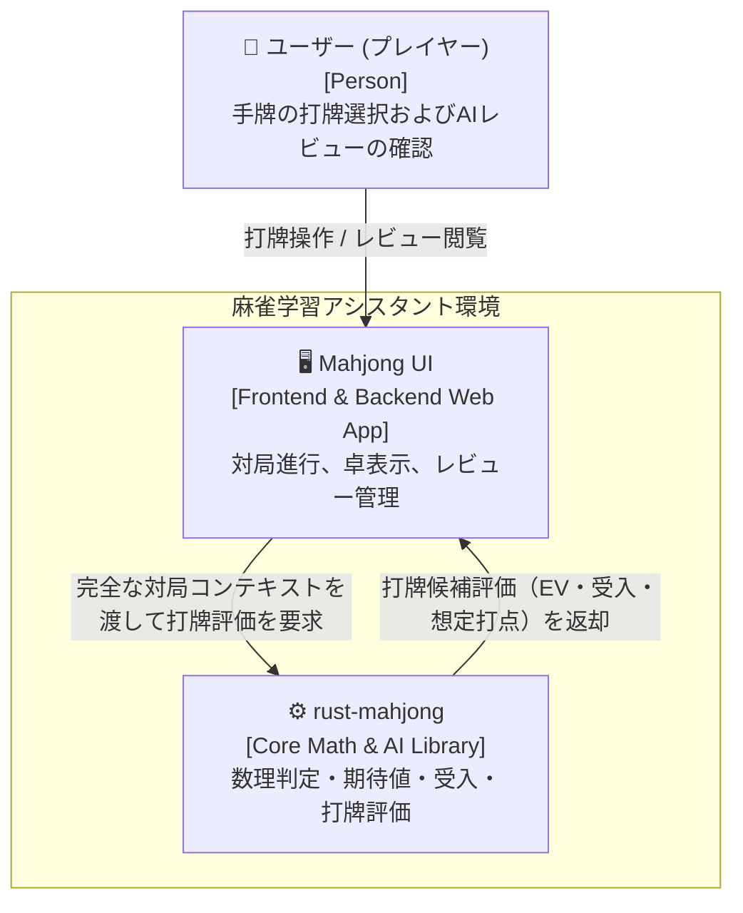
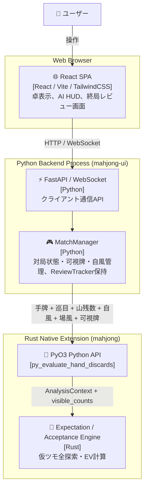

# 設計書：対局コンテキスト動的連携基盤（C4モデル準拠）

> C4モデル（Context / Container / Component）に準拠した設計書です。  
> 本設計書は、参照専用の `definition/templates/design.md` のテンプレートに基づき作成されています。

---

## メタ情報

| 項目 | 値 |
|------|-----|
| プロジェクト名 | mahjong-learning-assistant |
| モジュール名 | match-context-integration (対局コンテキスト動的連携基盤) |
| バージョン | 1.0.0 |
| 作成日 | 2026-09-14 |
| 最終更新日 | 2026-09-14 |
| 作成者 | AI Assistant |
| ステータス | Review |
| 関連要件書 | `docs/requirements/match-context-integration.md` |
| 関連ADR | `docs/adr/0006-match-context-integration.md` |

---

## 1. Level 1: システムコンテキスト図（Context Diagram）

### 1.1 説明
麻雀学習システムにおけるユーザー、Web UI、バックエンド（`MatchManager`）、およびコアAIエンジン（`rust-mahjong`）の関係を示します。



---

## 2. Level 2: コンテナ図（Container Diagram）

### 2.1 コンテナ図
実行単位（React Webフロントエンド、FastAPI/Python バックエンド、および Rust 拡張モジュール）の相互関係を示します。



---

## 3. Level 3: コンポーネント図 & シーケンス（Component Diagram）

### 3.1 打牌評価コンテキスト連携シーケンス

ユーザー打牌時に `MatchManager` が局所対局状態を集約し、Rust コアエンジンへ渡すシーケンスです。

```mermaid
sequenceDiagram
    autonumber
    actor User as 👤 ユーザー
    participant MM as MatchManager (Python)
    participant Core as python_api::py_evaluate_hand_discards (Rust)
    participant Exp as expectation::evaluate_hand_discards (Rust)
    participant RT as ReviewTracker (Rust)

    User->>MM: user_discard(tile_mpsz)
    
    rect rgb(240, 248, 255)
    Note over MM: 1. 対局コンテキストの集約
    MM->>MM: get_seat_wind(0) -> 自風 (東/南/西/北)
    MM->>MM: get_visible_tiles(0) -> [手牌 + 全家の河 + 全副露 + ドラ表示牌]
    end

    rect rgb(245, 255, 250)
    Note over MM,Core: 2. コンテキスト付き打牌評価
    MM->>Core: evaluate_hand_discards(hand, is_dealer, dora_indicators, turn_number, remaining_wall_tiles, seat_wind, round_wind, visible_tiles)
    Core->>Core: visible_tiles を [u8; 35] カウント配列へ変換
    Core->>Core: AnalysisContext 構造体を構築
    Core->>Exp: evaluate_hand_discards(&hand, Some(&visible_counts), &ctx)
    Exp-->>Core: Vec<CandidateEvaluation>
    Core-->>MM: candidates
    end

    MM->>RT: record_decision(turn_count, tile_to_discard, candidates)
    MM->>MM: 手牌から牌を除去し河に追加
    MM-->>User: 打牌完了 & CPUターン進行
```

---

## 4. 詳細インターフェース仕様

### 4.1 Rust Python API (`python_api.rs`)
```rust
#[pyfunction]
#[pyo3(signature = (
    tiles,
    is_dealer=None,
    dora_indicators=None,
    turn_number=None,
    remaining_wall_tiles=None,
    seat_wind=None,
    round_wind=None,
    visible_tiles=None,
))]
pub fn py_evaluate_hand_discards(
    tiles: Vec<PyTileName>,
    is_dealer: Option<bool>,
    dora_indicators: Option<Vec<PyTileName>>,
    turn_number: Option<usize>,
    remaining_wall_tiles: Option<usize>,
    seat_wind: Option<PyTileName>,
    round_wind: Option<PyTileName>,
    visible_tiles: Option<Vec<PyTileName>>,
) -> Vec<PyCandidateEvaluation>
```

- `visible_tiles` が渡された場合:
  ```rust
  let mut visible_counts = [0u8; 35];
  for t in v_tiles {
      let idx: usize = TileName::from(t) as usize;
      if idx <= 34 {
          visible_counts[idx] = visible_counts[idx].saturating_add(1);
      }
  }
  let evs = crate::expectation::evaluate_hand_discards(&hand, Some(&visible_counts), &ctx);
  ```

### 4.2 Python UI 側 (`match_manager.py`)
```python
def get_seat_wind(self, player_idx: int) -> TileName:
    """Calculates seat wind for player (East, South, West, North)."""
    winds = [TileName.East, TileName.South, TileName.West, TileName.North]
    # dealer is always East (wind index 0)
    wind_idx = (player_idx - self.dealer_idx) % 4
    return winds[wind_idx]

def get_visible_tiles(self, player_idx: int = 0) -> List[TileName]:
    """Aggregates all visible tiles from hand, rivers, open melds, and dora indicators."""
    visible: List[TileName] = []
    # 1. Player hand
    visible.extend(self.hands[player_idx])
    # 2. Rivers (discards of all 4 players)
    for river in self.rivers:
        visible.extend(river)
    # 3. Melds of all 4 players
    for meld_list in self.melds:
        for meld in meld_list:
            if hasattr(meld, "tiles"):
                visible.extend(meld.tiles)
    # 4. Dora indicators
    visible.extend(self.dora_indicators)
    return visible
```
