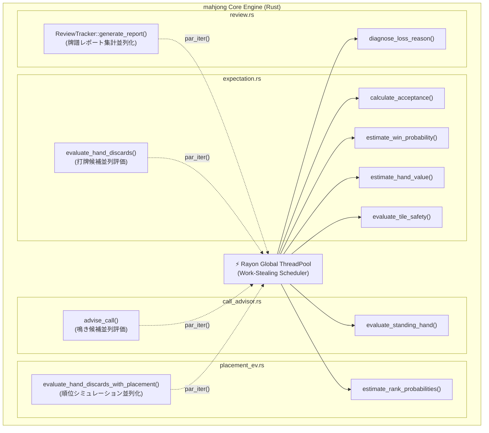
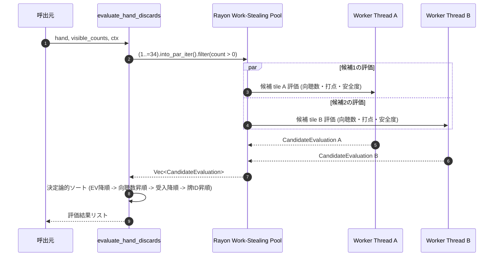
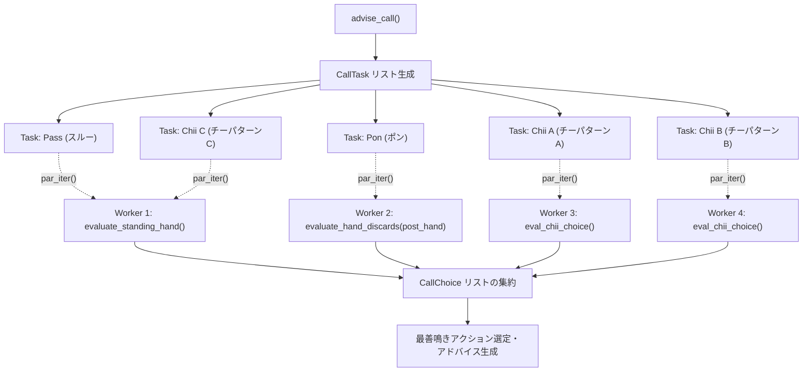

# 設計書: rayon による打牌候補評価・鳴き判断・着順EV・牌譜レビューの並列化

> C4モデル（Component Diagram）およびデータフローに準拠した設計書です。  
> Mermaid 記法を用いて並列実行フローとデータ依存性を可視化します。

---

## メタ情報

| 項目 | 値 |
|------|-----|
| プロジェクト名 | mahjong |
| 設計対象 | parallel-evaluation-rayon |
| バージョン | 1.0.0 |
| 作成日 | 2026-09-15 |
| 最終更新日 | 2026-09-15 |
| 作成者 | Antigravity AI |

---

## 1. システム構成・コンポーネント図（C4 Level 3）



---

## 2. 各対象機能の並列処理アーキテクチャ

### 2.1 打牌候補評価 (`expectation.rs`)

手牌（14枚）に存在する牌種（最大14種）について、打牌候補ごとに独立した手牌カウンタ `working` のコピーを作成し、並列に評価します。



#### スレッドセーフティとデータ独立性
- `hand.counts` は `[u8; 35]`（35バイトのスタック値）。各ワーカーが手牌カウンタをローカルコピーして1枚減算するため、ミュータブルな共有状態は存在しません。
- `base_visible` および `ctx` (`AnalysisContext`) は不変参照（`&base_visible`, `&AnalysisContext`）としてワーカー間で共有されます。これらはすべて `Sync` を満たします。

---

### 2.2 鳴き判断 (`call_advisor.rs`)

`advise_call()` では、スルー（門前維持）、ポン、チー（最大3パターン）の評価タスクを列挙し、`into_par_iter()` で並列評価します。



---

### 2.3 着順期待値評価 (`placement_ev.rs`)

素点評価済みの打牌候補リスト `raw_evaluations`（最大14件）に対し、各候補の「和了・放銃・流局シナリオ着順確率分布」のシミュレーション計算を並列化します。

```rust
let placement_evals: Vec<PlacementCandidateEvaluation> = raw_evaluations
    .into_par_iter()
    .map(|ev| {
        // 各シナリオの局後スコア・着順確率シミュレーション
        let probs_win = estimate_rank_probabilities(match_ctx, player_idx, score_on_win);
        let probs_deal = estimate_rank_probabilities(match_ctx, player_idx, score_on_deal);
        let probs_other = estimate_rank_probabilities(match_ctx, player_idx, score_on_other);
        ...
    })
    .collect();
```

---

### 2.4 牌譜レビュー処理 (`review.rs`)

`ReviewTracker::generate_report()` において、蓄積された `records: Vec<TurnDecisionRecord>` の集計と悪手診断文生成（`diagnose_loss_reason`）を並列化します。
Rayon の `par_iter()` を用いて、各レコードの `is_optimal`、`ev_loss` の加算、および `blunder` の判定・理由診断を並列に実行します。

```rust
let (optimal_picks_count, total_ev_loss, mut blunders) = self.records
    .par_iter()
    .fold(
        || (0usize, 0.0f64, Vec::new()),
        |(mut opt, mut loss, mut blunders), rec| {
            if rec.is_optimal { opt += 1; }
            loss += rec.ev_loss;
            if rec.ev_loss >= 150.0 {
                blunders.push(Self::build_blunder_record(rec));
            }
            (opt, loss, blunders)
        },
    )
    .reduce(
        || (0usize, 0.0f64, Vec::new()),
        |(opt1, loss1, mut blunders1), (opt2, loss2, blunders2)| {
            blunders1.extend(blunders2);
            (opt1 + opt2, loss1 + loss2, blunders1)
        },
    );
```

---

## 3. 型安全性・スレッドセーフティの検証

| 型 | `Send` | `Sync` | 備考 |
|---|:---:|:---:|---|
| `TileName` | ✅ | ✅ | `#[repr(u8)]`, `Copy`, `Clone` |
| `Hand` | ✅ | ✅ | `counts: [u8; 35]`, `open_melds: Vec<Meld>` |
| `AnalysisContext<'_>` | ✅ | ✅ | 不変参照のみを保持 |
| `MatchContext` | ✅ | ✅ | スコア・順位・ルール定義 |
| `CandidateEvaluation` | ✅ | ✅ | EV・向聴数・受入牌 |
| `TurnDecisionRecord` | ✅ | ✅ | 巡目打牌記録 |

---

## 4. Python API と GIL の取り扱い

Python API（`python_api.rs`）における `py_evaluate_hand_discards` などの関数では、すでに `py.allow_threads(...)` が導入されています。
Rayon によるマルチスレッドプール実行時にも Python GIL が解放されているため、GIL競合によるデッドロックや並列性阻害は発生せず、真のCPUマルチコア並列実行が保証されます。

---

## 5. 変更履歴

| バージョン | 日付 | 変更内容 | 変更者 |
|-----------|------|---------|--------|
| 1.0.0 | 2026-09-15 | 初版作成（Issue #88 に基づく） | Antigravity AI |
