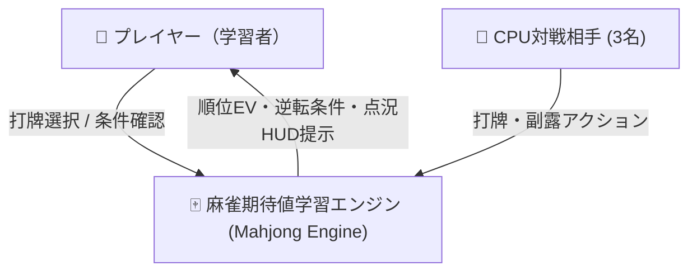
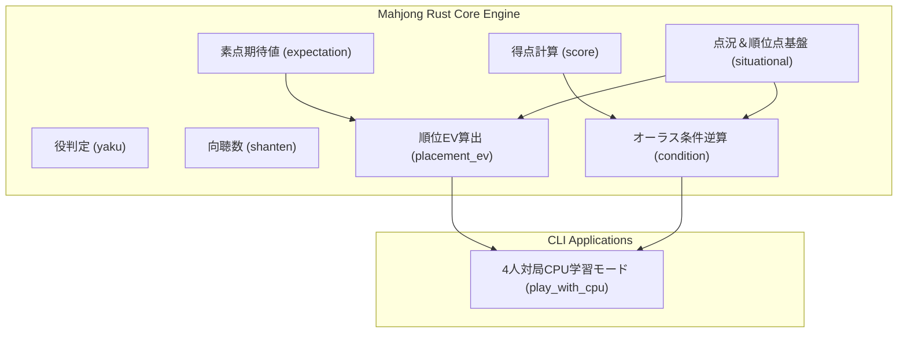
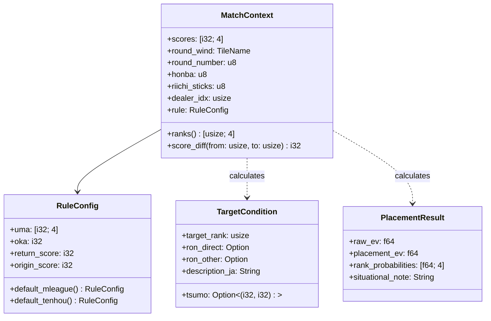

# 設計書：点況判断・順位期待値（順位EV）学習モデル

> C4モデル（Context / Container / Component）準拠  
> 本設計書は、参照専用の `definition/templates/design.md` のテンプレートに基づき作成されています。

---

## メタ情報

| 項目 | 値 |
|------|-----|
| プロジェクト名 | mahjong-learning-assistant |
| モジュール名 | placement-ev-model |
| バージョン | 1.0.0 |
| 作成日 | 2026-09-14 |
| 最終更新日 | 2026-09-14 |
| 作成者 | Syun & AI Assistant |

---

## 1. Level 1: システムコンテキスト図 (Context Diagram)

### 1.1 説明
プレイヤーは4人対局環境（または学習ドリル）において、自身の打牌候補ごとに「素点EV」だけでなく、点棒状況・順位点・オーラス条件を反映した「順位EV（Pt EV）」のフィードバックを受け取ります。

### 1.2 コンテキスト図

---

## 2. Level 2: コンテナ図 (Container Diagram)

### 2.1 説明
Rustネイティブコアライブラリ（`src/mahjong`）内に、点況状態および順位EV・条件逆算を司るモジュール群を追加します。

---

## 3. Level 3: コンポーネント図 (Component Diagram)

### 3.1 モジュール構成とデータ構造

### 3.2 主要アルゴリズム

#### A. 順位Pt（終局時ポイント）の定義
プレイヤーの最終持ち点を $S_i$（点）、着順順位点を $U_i$（pt）とすると、
$$Pt_i = \frac{S_i - \text{return\_score}}{1000} + U_i$$
（例: Mリーグ形式では 30,000点返し、ウマ+50/+10/-10/-30、オカ+20）。

#### B. 順位確率と順位EV
局終了時の各打牌 $d$ による持ち点変動ベクトルを $\Delta S(d)$ とし、その局での和了・放銃・流局確率から次局以降の着順確率分布 $P(\text{Rank}=k \mid d)$ を推定する。
$$\text{Placement EV}(d) = \sum_{k=1}^4 P(\text{Rank}=k \mid d) \times \left( \frac{\mathbb{E}[S_k] - 30000}{1000} + U_k \right)$$

#### C. オーラス条件逆算アルゴリズム
南4局において、自家（$p$）が目標着順の他家（$t$）を捲るために必要な点差 $\Delta = S_t - S_p$：
- **直撃（$t$ からの出和了）**:
  和了点を $X$、本場を $H$（300点/本場）とすると、$2X + 2 \times 300H > \Delta \implies X > \frac{\Delta - 600H}{2}$
- **ツモ**:
  親/子の支払いを考慮し、$X_{\text{total}} + \text{自家加点} + t\text{の失点} > \Delta$
- **他家出和了**:
  $X + 300H > \Delta$
これらを達成する最小の飜・符組み合わせ（例: 2000点、3900点、満貫8000点、跳満12000点等）を自動判定。

---

## 4. 検証戦略

1. **オーラス条件逆算テスト**:
   - 満貫直撃で逆転、跳満ツモで逆転、3900点出和了で逆転などの典型的な点差パターンを検証。
2. **順位EV計算テスト**:
   - ダントツトップ時に放銃失点リスクを極大評価し、守備的打牌の順位EVが高くなることを検証。
   - ラス目で安手アガリの価値が低く、打点向上が順位EVを最大化することを検証。
