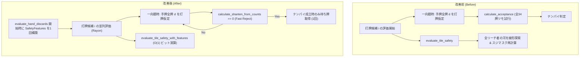

# 基本・詳細設計書: 一向聴打点推定の探索削減 & 安全度事前計算

> GitHub Issue: #104「perf(expectation): 一向聴打点推定における不要な受け入れ全探索ループの削減」に対応する設計書です。

---

## 1. アーキテクチャ概要

本設計では、`src/mahjong/expectation.rs` における2大ボトルネック（一向聴テンパイ打点探索の全探索オーバーヘッド、および打牌候補ごとの河走査オーバーヘッド）を解消します。

### 1.1 改善前後の処理フロー比較



---

## 2. 詳細設計

### 2.1 一向聴テンパイ打点推定の Fast Reject

#### アルゴリズム
`estimate_hand_value` 内で `shanten == 1` の場合：
```rust
for &adv_tile in accepted_tiles.iter().take(sample_count) {
    working[adv_tile as usize] += 1;

    let mut best_move: Option<(usize, TileName)> = None;
    for d in 1..=34 {
        if working[d] == 0 {
            continue;
        }
        working[d] -= 1;
        // Fast Check: シャンテン数が0になるかのみを判定
        let res = calculate_shanten_from_counts(&working, open_melds.len());
        if res.min_shanten == 0 {
            // テンパイになった打牌でのみ、和了牌を取得
            let sub_acc = calculate_acceptance(&working, open_melds.len(), None);
            if !sub_acc.waits.is_empty() {
                best_move = Some((d, sub_acc.waits[0].tile));
                working[d] += 1;
                break;
            }
        }
        working[d] += 1;
    }
    // ...
}
```

### 2.2 `SafetyFeatures` の構造と事前集計

#### 構造体定義
```rust
#[derive(Debug, Clone, Copy, PartialEq, Eq)]
pub struct SafetyFeatures {
    /// 相手プレイヤーにリーチ者が1人以上存在するか
    pub has_riichi_threat: bool,
    /// リーチ者数
    pub riichi_count: usize,
    /// 全リーチ者に対して現物である牌のビットマスク (1 << tile_idx)
    pub genbutsu_all_mask: u64,
    /// いずれかのリーチ者に対して現物である牌のビットマスク (1 << tile_idx)
    pub genbutsu_any_mask: u64,
    /// 各スーツ (0:萬, 1:筒, 2:索) におけるリーチ者の河ランクビットマスク (1 << rank)
    pub riichi_river_ranks: [u16; 3],
}
```

#### 事前集計ロジック (`SafetyFeatures::from_context`)
1. 自家（`ctx.target_player`）以外のリーチ者を特定。
2. リーチ者が0人の場合、`has_riichi_threat = false`、全マスク0で即座に返却。
3. リーチ者が存在する場合：
   - 各リーチ者 $p$ について、`ctx.player_rivers.get(p)` から河を取得。
   - 河が存在しない（河欠損）場合、そのリーチ者の現物は存在しないため `all` 現物マスクはクリアされ、`genbutsu_all` は false となる。
   - 河が存在する場合、河の全牌 $t$ について `1 << (t as usize)` をセットしたプレイヤー別マスクを作成。
   - 各リーチ者マスクの AND（全現物）および OR（一部現物）を算出。
   - 数牌のランク（1..=9）を `riichi_river_ranks[suit] |= 1 << rank` に集約。

#### O(1) 安全度判定 (`evaluate_tile_safety_with_features`)
- 現物判定: `tile_mask = 1u64 << idx`
  - `(genbutsu_all_mask & tile_mask) != 0` -> 完全安全 (risk: 0.0)
  - `(genbutsu_any_mask & tile_mask) != 0` -> 一部現物 (risk: 0.20)
- スジ判定: 事前計算された `riichi_river_ranks[suit]` に対するビットマスク判定（O(1)）。
- 可視牌・カベ判定: `visible_counts[idx]` のチェック。

---

## 3. テスト計画

### 3.1 同値性検証テスト (`tests/test_safety_precomputation.rs`)
- パターン 1: リーチ者なし（平時）における全34牌の判定結果一致。
- パターン 2: 単独リーチ（親リーチ・子リーチ）における全34牌の一致。
- パターン 3: 複数リーチ（2人・3人リーチ）における全現物・一部現物・スジ判定の一致。
- パターン 4: 河欠損（`player_rivers` が空、または長さ不足）時の挙動一致。

### 3.2 ベンチマーク (`benches/mahjong_benchmark.rs`)
- `evaluate_hand_discards (Iishanten & Multiple Riichi)` を追加し、改修前後のレイテンシ改善を計測。
