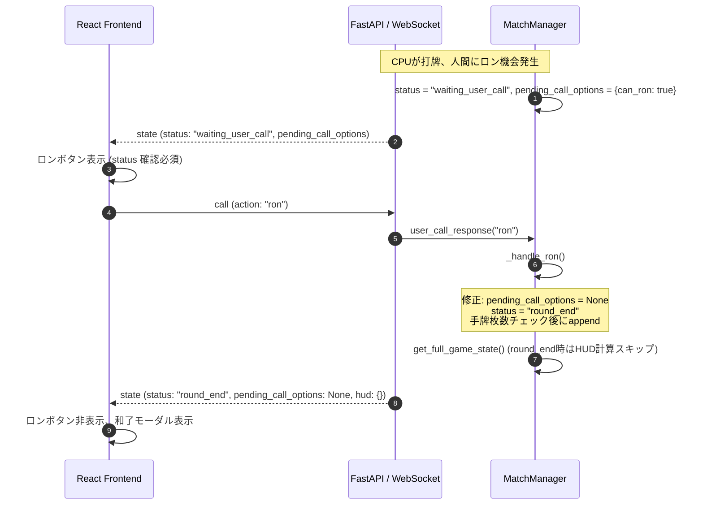

# 基本設計書: ロン和了処理の安定化及び通信整合性保証

## 1. アーキテクチャと変更点概要

本設計では、ロン和了発生時のバックエンド状態遷移とフロントエンドのプロンプト表示・通信管理における以下の課題を解決する。

## 2. 詳細設計

### 2.1 バックエンド (`match_manager.py`)
1. **`_handle_ron(winner, loser, tile)`**:
   - `self.pending_call_options = None` を明示的に設定。
   - 和了牌の追加（`self.hands[winner]`）は、`len(self.hands[winner]) % 3 == 1`（一般手牌13枚など）の場合にのみ `append(tile)` を実行。
   - `self.status = "round_end"` を設定。
2. **`_handle_ryuukyoku()` & `start_round()`**:
   - 同様に `self.pending_call_options = None` および `self.last_discard = None`（新局時）をリセット。
3. **`get_full_game_state()`**:
   - HUD 計算条件を厳密化：
     `state["hud"] = self.get_hud_data() if (self.status == "waiting_user_discard" and self.current_turn == 0) else {}`
   - これにより、`round_end` 時や CPU 手番での不要な計算負荷と例外リスクを完全に排除。

### 2.2 フロントエンド (`ActionPrompt.tsx` / `TableLayout.tsx`)
1. **`ActionPromptProps` に `matchStatus: string` を追加**:
   - `hasCallOptions = (matchStatus === "waiting_user_call") && callOptions && (callOptions.can_ron || callOptions.can_pon || callOptions.can_chi)` とする。
2. **連打防止**:
   - ボタン押下時に内部フラグ `isSubmitting` を立て、処理完了または状態変更までボタンを非活性化。

### 2.3 フロントエンド通信層 (`App.tsx`)
1. **WebSocket 再接続管理の正常化**:
   - `isSubscribed` フラグによるアンマウント検知。
   - `setTimeout` のタイマーIDを保持し、クリーンアップ時に `clearTimeout` を実行。
2. **送信時のソケット状態確認**:
   - `wsRef.current?.readyState === WebSocket.OPEN` を判定して WebSocket 送信し、確実に開いている時のみ使用。
