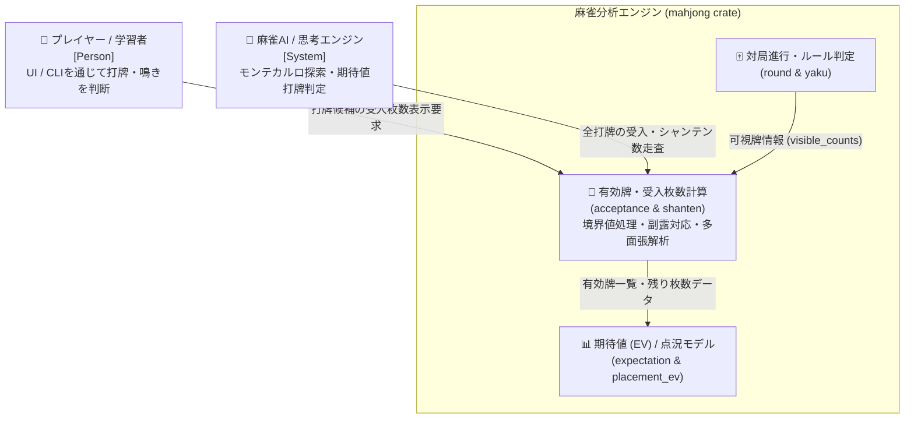
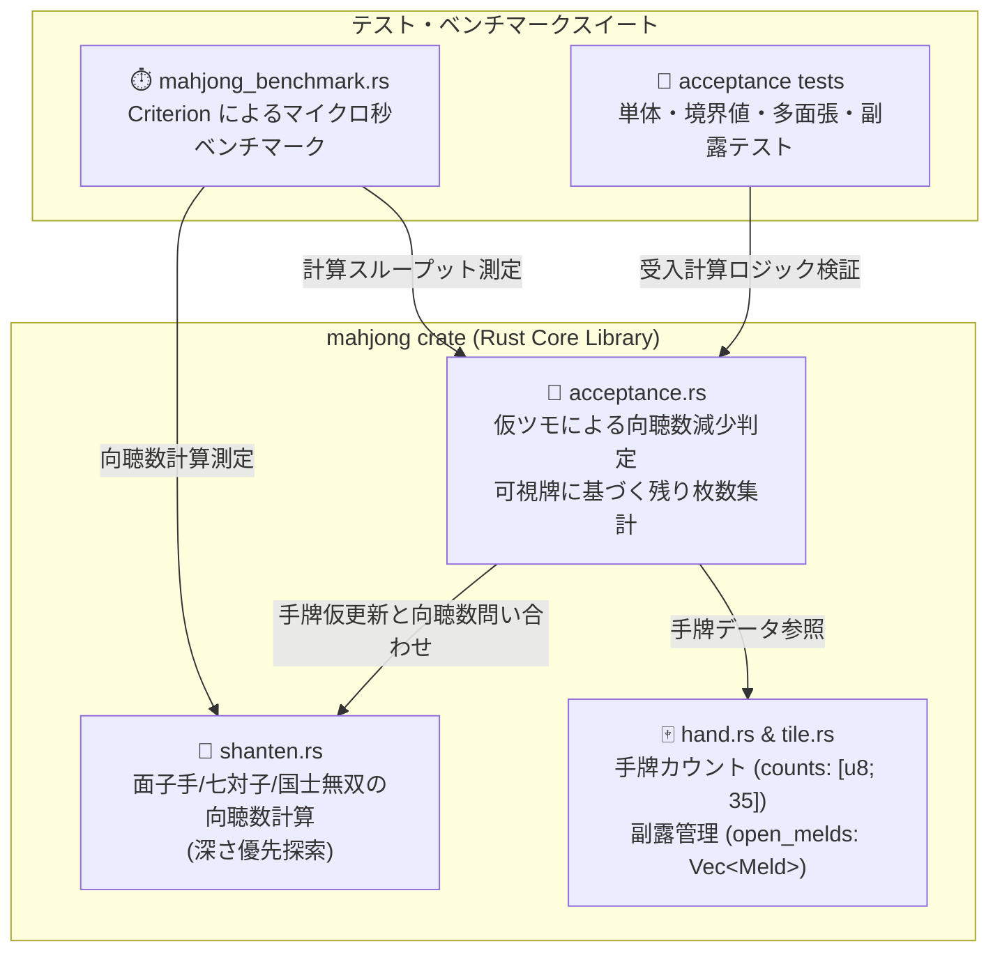
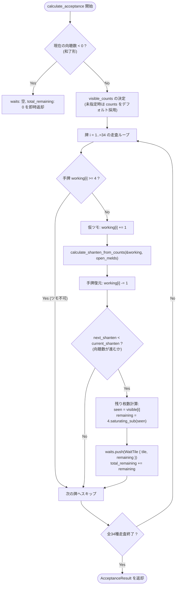

# 設計書：シャンテン数・受入枚数計算の境界値検証と評価テストの拡充

> C4モデル（Context / Container / Component）準拠  
> 本設計書は、参照専用の `definition/templates/design.md` のテンプレートに基づき作成されています。

---

## メタ情報

| 項目 | 値 |
|------|-----|
| プロジェクト名 | mahjong-core-engine |
| モジュール名 | acceptance & shanten (向聴数・有効牌受入計算エンジン) |
| Issue | [#75 [分析エンジン] シャンテン数・受入枚数計算の境界値検証と評価テストの拡充](https://github.com/applyuser160/mahjong/issues/75) |
| バージョン | 1.0.0 |
| 作成日 | 2026-09-14 |
| 最終更新日 | 2026-09-14 |
| 作成者 | Syun & AI Assistant |

---

## 1. Level 1: システムコンテキスト図（Context Diagram）

### 1.1 説明
`mahjong` コアエンジンにおいて、向聴数（`shanten`）および有効牌・受入枚数計算（`acceptance`）は、AIの打牌選択（`call_advisor`, `expectation`）、ドリル学習機能（`drill`）、および対局レビュー機能（`review`）の基盤数理アルゴリズムとして機能します。

### 1.2 コンテキスト図

---

## 2. Level 2: コンテナ図（Container Diagram）

### 2.1 コンテナ図

### 2.2 主要データ構造

| 構造体 / 関数 | 責務 | 入力 | 出力 |
|--------------|------|------|------|
| `calculate_acceptance` | 13枚の手牌に対する向聴数進行牌の網羅算出 | `counts: &[u8; 35]`, `open_melds_count: usize`, `visible_counts: Option<&[u8; 35]>` | `AcceptanceResult` |
| `analyze_all_discards` | 14枚手牌の全打牌候補における打牌後受入解析 | `hand: &Hand`, `visible_counts: Option<&[u8; 35]>` | `Vec<DiscardAnalysis>` |
| `calculate_shanten_from_counts` | 牌カウントと副露数からの最小シャンテン数算出 | `counts: &[u8; 35]`, `open_melds_count: usize` | `ShantenResult` |

---

## 3. Level 3: コンポーネント図 & アルゴリズム詳細（Component Diagram）

### 3.1 仮ツモ受入判定と境界値処理フロー

`calculate_acceptance` の処理フローにおいて、境界値（手牌4枚、純カラ、和了手）が以下のように安全かつ正確に評価されます。

### 3.2 境界値設計のポイント

1. **手牌4枚所持のツモ除外 (`working[i] >= 4`)**:
   - 麻雀牌は各牌4枚しか存在しないため、自身の手牌にすでに4枚ある牌はツモることが物理的に不可能です。
   - `working[i] >= 4` を早期に弾くことで、余分なシャンテン数計算を削減しつつ、不正な受入牌（1m1m1m1m所持時の1m引きなど）の発生を防止します。

2. **可視牌4枚（純カラ・ヤマゼロ）の扱い**:
   - 場（河・他家副露・ドラ表示牌等）に4枚見えている場合でも、形としては和了やシャンテン数進行の対象であるため `waits` リストに保持されます。
   - 残り枚数は `4u8.saturating_sub(seen)` により `0` となり、`total_remaining` への加算は `+0` となります。
   - `saturating_sub` により、万が一可視牌カウントに 5 以上の異常値が渡された場合でも整数アンダーフロー（パニック）を防ぎ、安全に `0` が算出されます。

3. **副露手牌（鳴き手）の受入計算**:
   - `open_melds_count`（1〜4）がそのまま `calculate_shanten_from_counts` に伝搬されます。
   - 目標面子数が `4 - open_melds_count` となり、4副露（手牌1枚・裸単騎）の場合は `target_melds = 0` となって単騎待ち（雀頭候補）のみが有効牌として抽出されます。

---

## 4. テスト設計（拡充テストケース一覧）

### 4.1 境界値テストケース

| テスト関数名 | 検証シナリオ | 期待結果 |
|-------------|-------------|---------|
| `test_acceptance_hand_four_copies_excluded` | 手牌に `1m` が4枚ある状態 (`1m1m1m1m 2m3m ...`) | `1m` は有効牌から除外され、`4m` のみが有効牌となる |
| `test_acceptance_zero_remaining_visible_tiles` | テンパイ時（`1s4s` 待ち）に `1s` が場に4枚見えている | `waits` に `1s` (rem: 0) と `4s` (rem: 4) が含まれ、`total_remaining` は 4 となる |
| `test_acceptance_completely_empty_waits` | テンパイ時（`1s4s` 待ち）に両方とも場に4枚見えている（純カラ） | `waits` に両牌 (rem: 0) が含まれ、`total_remaining` は 0 となる |
| `test_acceptance_visible_counts_overflow_safe` | `visible_counts` に 5 以上の異常値が指定された場合 | パニックせず `saturating_sub` で `remaining: 0` となる |
| `test_acceptance_already_agari_returns_empty` | シャンテン数 -1（和了手）を入力した場合 | `waits` が空、`total_remaining` が 0、`current_shanten` が -1 となる |

### 4.2 副露手牌（鳴き手）テストケース

| テスト関数名 | 検証シナリオ | 期待結果 |
|-------------|-------------|---------|
| `test_acceptance_one_open_meld` | 1副露手牌（手牌10枚, チー済）の両面待ち | テンパイ、待ち2種8枚が正確に算出される |
| `test_acceptance_two_open_melds` | 2副露手牌（手牌7枚, チー・ポン）のシャンポン待ち | テンパイ、待ち2種4枚が正確に算出される |
| `test_acceptance_three_open_melds` | 3副露手牌（手牌4枚）の嵌張待ち | テンパイ、待ち1種4枚が正確に算出される |
| `test_acceptance_naked_tanki_four_melds` | 4副露手牌（手牌1枚：裸単騎、例: 東単騎） | テンパイ、待ち `東` 1種3枚（手牌の1枚を除く）が正確に算出される |
| `test_acceptance_open_meld_tiles_in_visible_counts` | 副露した牌が `visible_counts` に加算された場合 | 残り枚数から副露牌が確実に減算されている |

### 4.3 多面張テストケース

| テスト関数名 | 検証シナリオ | 期待結果 |
|-------------|-------------|---------|
| `test_acceptance_sanmenchan` | 3面張（例: `23456m` テンパイ） | `1m, 4m, 7m` の3種12枚が正確に算出される |
| `test_acceptance_gomenchan` | 5面張（例: `2345556m` テンパイ） | 5種すべての待ち牌が漏れなく抽出される |
| `test_acceptance_chuuren_poutou_9_waits` | 純正九蓮宝燈テンパイ（`1112345678999m`） | `1m`〜`9m` の全9種、計23枚（1m:1枚, 2-8m:各3枚, 9m:1枚）が完全一致 |
| `test_acceptance_fully_developed_iishanten` | 完全一向聴（両面2組 + 対子 + 暗刻） | 全有効牌の種類数および合計枚数が正確に算出される |

---

## 5. ベンチマーク設計 (`benches/mahjong_benchmark.rs`)

### 5.1 測定グループ `Shanten and Acceptance`

1. **`bench_shanten`**:
   - `Pinfu Iishanten` (典型的な門前一向聴)
   - `Complex Chinitsu` (分岐数の多い清一色手牌)
   - `Chitoitsu / Kokushi` (特殊役の判定)
2. **`bench_acceptance`**:
   - `Ryamen Tenpai` (門前両面テンパイ受入計算)
   - `Perfect Iishanten` (完全一向聴受入計算)
   - `Chuuren 9-waits` (最長分岐多面張受入計算)
   - `Naked Tanki (4 Melds)` (副露手牌受入計算)
3. **`bench_analyze_all_discards`**:
   - `14-tiles Normal Hand` (14枚手牌に対する全打牌評価)

---

## 6. 変更履歴

| バージョン | 日付 | 変更内容 | 変更者 |
|-----------|------|---------|--------|
| 1.0.0 | 2026-09-14 | 初版作成（C4モデル、境界値アルゴリズム、テストマトリクス、ベンチマーク設計） | Syun & AI Assistant |
