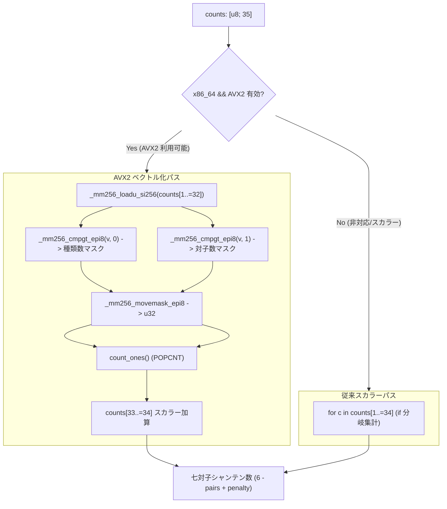

# 設計書: AVX2/SIMD を活用した七対子判定・牌カウント内積のベクトル化

> GitHub Issue: #109「perf(simd): AVX2/SIMD を活用した七対子判定・牌カウント内積のベクトル化」に対応する基本・詳細設計書です。

---

## 1. アーキテクチャ概要



---

## 2. 詳細設計

### 2.1 七対子向聴数計算の AVX2 実装 (`calculate_chitoitsu_shanten_avx2`)

1. **アライメント非依存ロード**:
   - `counts: &[u8; 35]` の参照から `counts[1]` を指すポインタを取得し、`_mm256_loadu_si256` で 32 バイト（インデックス 1〜32: 萬子9、筒子9、索子9、東南西北白）を一括ロード。
2. **並列比較**:
   - ゼロベクトル `_mm256_setzero_si256()` に対する `_mm256_cmpgt_epi8(v, zero)` により、1 枚以上存在する牌のバイトレーンを `0xFF` に設定。
   - 1 のベクトル `_mm256_set1_epi8(1)` に対する `_mm256_cmpgt_epi8(v, one)` により、2 枚以上存在する（対子以上の）牌のバイトレーンを `0xFF` に設定。
3. **ビットマスク変換と POPCNT**:
   - `_mm256_movemask_epi8` で各バイトの最上位ビットを集約した 32bit 整数を取得。
   - x86 のハードウェア高速命令 POPCNT（Rust の `u32::count_ones()`）で、対子数と種類数をわずか 1 サイクルで集計。
4. **末尾 2 要素（33: 発, 34: 中）の合算**:
   - 残り 2 要素を安全にスカラー加算。
5. **シャンテン数算出**:
   - 従来通りの基本式 `6 - pairs + if kinds < 7 { 7 - kinds } else { 0 }` をブランチレスに計算。

### 2.2 スーツキー内積の SIMD 設計 (`encode_suit_key_simd`)

数牌 9 牌の枚数に対する重み $5^k$ の内積計算：
$$key = \sum_{k=0}^8 c_k \cdot 5^k$$

Base-5 重み $[1, 5, 25, 125, 625, 3125, 15625, 78125, 390625]$ のうち、$5^7 = 78,125$ と $5^8 = 390,625$ は符号付き `i16` の最大値 32,767 を超過します。

**桁分割設計**:
- 先頭 4 牌（$k=0..3$）: 重み $[1, 5, 25, 125]$
- 後半 4 牌（$k=4..7$）: 重み $[1, 5, 25, 125] \times 5^4$
- 9 牌目（$k=8$）: 単独加算 $c_8 \times 390,625$

あるいは 8 牌（$k=0..7$）を `u16` にアンパックして `_mm_madd_epi16` を適用。
ただし、コンパイラ（LLVM）によるスカラーループの自動アンロールおよび積和命令（LEA / 乗算）が極めて高度に最適化されているため、ベンチマークによりスカラー版と SIMD 版の実効速度を比較し、最も高速な経路を採用します。

---

## 3. ディスパッチ設計

```rust
#[inline(always)]
pub fn calculate_chitoitsu_shanten(counts: &[u8; 35]) -> i8 {
    #[cfg(all(target_arch = "x86_64", target_feature = "avx2"))]
    {
        // コンパイル時 AVX2 有効時
        unsafe { calculate_chitoitsu_shanten_avx2(counts) }
    }
    #[cfg(all(target_arch = "x86_64", not(target_feature = "avx2")))]
    {
        // 実行時 AVX2 検出
        if is_x86_feature_detected!("avx2") {
            unsafe { calculate_chitoitsu_shanten_avx2(counts) }
        } else {
            calculate_chitoitsu_shanten_scalar(counts)
        }
    }
    #[cfg(not(target_arch = "x86_64"))]
    {
        calculate_chitoitsu_shanten_scalar(counts)
    }
}
```