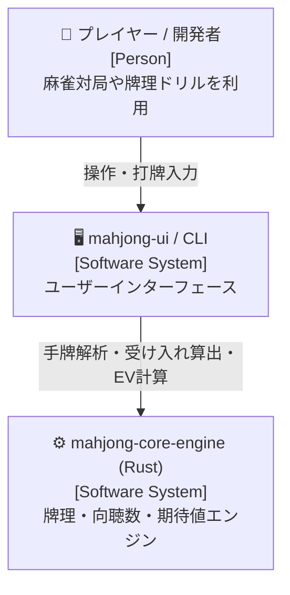
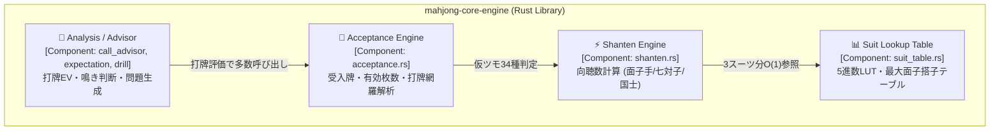
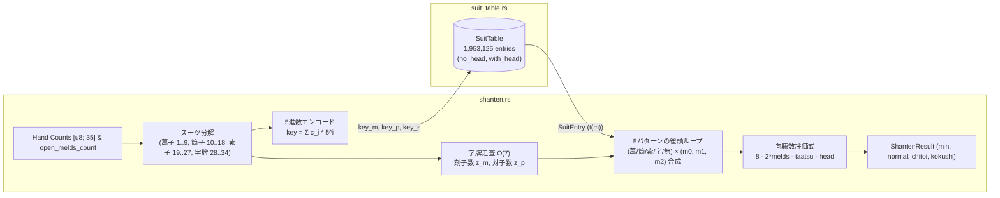

# 設計書：向聴数計算へのスーツ別ルックアップテーブル導入

> C4モデル（Context / Container / Component）準拠  
> 本設計書は、参照専用の `definition/templates/design.md` のテンプレートに基づき作成されています。

---

## メタ情報

| 項目 | 値 |
|------|-----|
| プロジェクト名 | mahjong-core-engine |
| モジュール名 | shanten & acceptance |
| Issue | [#86 perf: 向聴数計算にスーツ別ルックアップテーブルを導入する](https://github.com/applyuser160/mahjong/issues/86) |
| バージョン | 1.0.0 |
| 作成日 | 2026-09-15 |
| 最終更新日 | 2026-09-15 |
| 作成者 | Syun & AI Assistant |

---

## 1. Level 1: システムコンテキスト図（Context Diagram）

### 1.1 説明
本システム（`mahjong-core-engine`）は麻雀の牌理計算・向聴数判定・受け入れ計算・期待値（EV）評価・対局進行を行うコアライブラリです。
GUIクライアント（`mahjong-ui`）や各種CLIツール、AI思考エンジン（CPU Match, Drill, Call Advisor）が本ライブラリを利用します。
本機能改善では、コアライブラリ内部の向聴数計算エンジンにルックアップテーブル（LUT）を組み込み、上位モジュールへの変更なしに透過的な大幅高速化を提供します。

### 1.2 コンテキスト図



### 1.3 外部アクター・外部システム一覧

| 名前 | 種別 | 説明 |
|------|------|------|
| プレイヤー / 開発者 | Person | 麻雀対局・牌理ドリル・評価ツールを利用するユーザー |
| mahjong-ui / CLI | Software System | 手牌表示や打牌候補の受入・期待値一覧を表示するUI層 |
| mahjong-core-engine | Software System | 向聴数計算・受入計算・役判定等を実行するRustコアエンジン |

---

## 2. Level 2: コンテナ図（Container Diagram）

### 2.1 コンテナ図



### 2.2 コンテナ一覧

| コンテナ名 | 技術スタック | 責務 | 通信プロトコル |
|-----------|------------|------|--------------|
| Analysis / Advisor | Rust (call_advisor, expectation) | 打牌期待値計算、副露推奨、ドリル生成 | 内部関数呼出 (In-process) |
| Acceptance Engine | Rust (acceptance) | 各打牌候補の向聴数・受入牌・受入枚数の網羅計算 | 内部関数呼出 (In-process) |
| Shanten Engine | Rust (shanten) | 手牌全体の向聴数判定（面子手・特殊手） | 内部関数呼出 (In-process) |
| Suit Lookup Table | Rust (suit_table) | 5進数インデックス管理とスーツ別最大搭子数テーブルの提供 | $O(1)$ メモリアクセス |

---

## 3. Level 3: コンポーネント図（Component Diagram）

### 3.1 構造とデータフロー



### 3.2 データ構造設計

#### 3.2.1 `SuitEntry` 構造体
各スーツにおける「雀頭なし」「雀頭あり」の各状態において、面子数 $m \in [0, 4]$ を作ったときに作れる搭子数 $t$ の最大値を格納します。

```rust
/// スーツ内の面子数 0..=4 に対する最大搭子数テーブル
/// 値が -1 の場合はその面子数が物理的に作成不可能であることを表す
#[derive(Clone, Copy, Debug, PartialEq, Eq)]
pub struct SuitEntry {
    /// 雀頭なしの場合の各面子数 m (0..=4) に対する最大搭子数
    pub no_head: [i8; 5],
    /// 雀頭ありの場合の各面子数 m (0..=4) に対する最大搭子数
    pub with_head: [i8; 5],
}
```

- メモリサイズ: 1エントリあたり 10バイト。
- テーブル全体: $1,953,125 \times 10 = 19,531,250 \text{ Bytes} \approx 18.6 \text{ MiB}$。
- テーブルは `build.rs` でコンパイル時にバイナリファイル `suit_table.bin` として事前生成され、`include_bytes!` でアライメントを保証して静的メモリに展開されます。これにより**実行時の初回初期化遅延は 0.00ms（完全ゼロ）**となります。

#### 3.2.2 5進数キーの算出と異常値安全防衛
入力スライス内の各牌枚数に対して `min(4)` による飽和処理を適用することで、同一牌が5枚以上の異常値でも配列境界外アクセス（panic）を防止します。

```rust
#[inline(always)]
pub fn encode_suit_key(counts: &[u8]) -> usize {
    let mut key = 0;
    let mut mult = 1;
    for &c in counts {
        let safe_c = (c.min(4)) as usize;
        key += safe_c * mult;
        mult *= 5;
    }
    key
}
```

### 3.3 向聴数計算アルゴリズム

1. **スーツ分割とキー算出**:
   - 萬子: `counts[1..=9]` $\to key_m$
   - 筒子: `counts[10..=18]` $\to key_p$
   - 索子: `counts[19..=27]` $\to key_s$
   - 各エントリ $E_m, E_p, E_s$ を LUT から一発で取得（$O(1)$）。

2. **字牌（28..=34）の集計 ($O(7)$)**:
   - 枚数 $c \ge 3$ $\implies$ 刻子数 $z_m \mathrel{+}= 1$（4枚の場合は余り1枚は孤立牌）。
   - 枚数 $c = 2$ $\implies$ 対子数 $z_p \mathrel{+}= 1$。

3. **雀頭候補ループ（5パターン）**:
   - パターン 0: 萬子に雀頭あり（萬子は $E_m.\text{with\_head}$、他は $\text{no\_head}$、字牌は $z_m, z_p$）
   - パターン 1: 筒子に雀頭あり（筒子は $E_p.\text{with\_head}$、他は $\text{no\_head}$、字牌は $z_m, z_p$）
   - パターン 2: 索子に雀頭あり（索子は $E_s.\text{with\_head}$、他は $\text{no\_head}$、字牌は $z_m, z_p$）
   - パターン 3: 字牌に雀頭あり
     - $z_p > 0$ ならば対子の1つを雀頭にし、$z_p \mathrel{-}= 1$。
     - $z_p = 0$ かつ $z_m > 0$ ならば刻子の1つを雀頭にし、$z_m \mathrel{-}= 1$。
     - どちらも無ければ字牌雀頭は成立不可。
   - パターン 4: 雀頭なし（全スーツ $\text{no\_head}$、字牌は $z_m, z_p$）

4. **面子数の直積ループ**:
   - 各スーツで作る面子数 $(m_m, m_p, m_s)$ について、$m_m + m_p + m_s + z_m \le 4 - \text{open\_melds\_count} + 1$ の範囲を探索。
   - 各スーツの最大搭子数を合算: $T = t_m(m_m) + t_p(m_p) + t_s(m_s) + z_p$。
   - 面子数 $M = m_m + m_p + m_s + z_m$。
   - 向聴数を評価式により計算し、全探索空間における最小値を採用。

---

## 4. テスト計画・検証方針

1. **回帰テスト**:
   - `test_shanten.rs`, `test_acceptance.rs`, `test_placement_ev.rs`, `test_round.rs` を含む既存のすべてのテストを実行し、100% パスすることを確認。
2. **網羅的一致検証テスト**:
   - ランダム手牌数万件を生成し、現行のバックトラッキング版と新LUT版の `calculate_normal_shanten` が完全に同一の向聴数を返すことを検証する単体テストを追加。
3. **ベンチマーク測定**:
   - `cargo bench --bench mahjong_benchmark -- "Shanten and Acceptance"` を実行し、改善前後の実行時間を比較。
