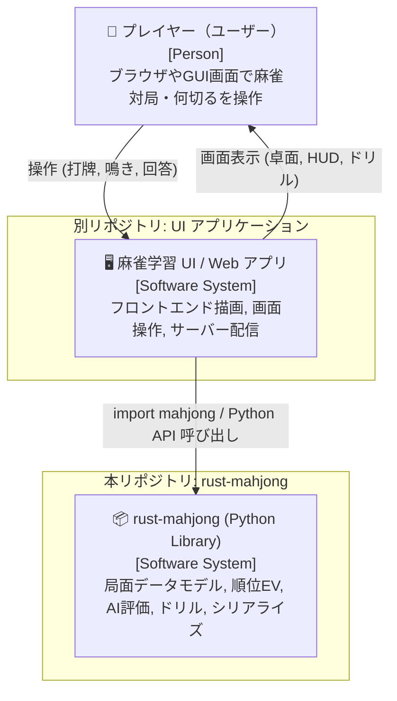
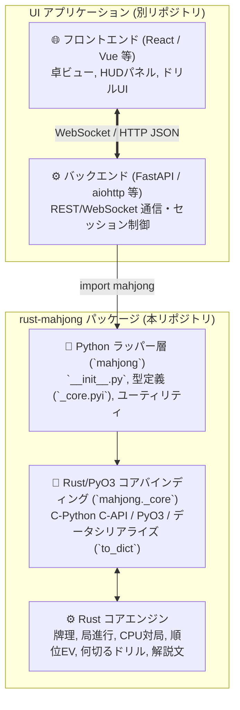
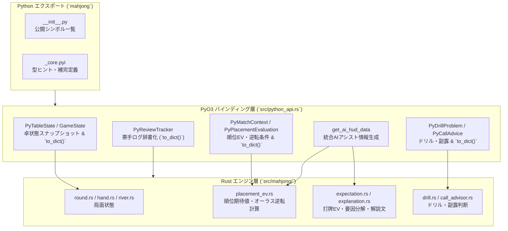

# 設計書：UI連携用 Python API & シリアライズ基盤

> C4モデル（Context / Container / Component）準拠  
> 本設計書は、参照専用の `definition/templates/design.md` のテンプレートに基づき作成されています。

---

## メタ情報

| 項目 | 値 |
|------|-----|
| プロジェクト名 | mahjong-learning-assistant |
| モジュール名 | ui-integration-api (UI連携用 Python API & シリアライズ基盤) |
| バージョン | 1.0.0 |
| 作成日 | 2026-09-14 |
| 最終更新日 | 2026-09-14 |
| 作成者 | Syun & AI Assistant |
| ステータス | Review |

---

## 1. Level 1: システムコンテキスト図（Context Diagram）

### 1.1 説明
本システム（`rust-mahjong`）は、麻雀数理・判定・AI評価エンジンを提供する Python ライブラリです。  
別リポジトリとして開発される「UI アプリケーション（Web/デスクトップ）」が本ライブラリを `import mahjong` して利用し、エンドユーザー（プレイヤー）へ麻雀卓のビジュアル描画やAIアシストHUDを提供します。

### 1.2 コンテキスト図



### 1.3 外部アクター・外部システム一覧

| 名前 | 種別 | 説明 |
|------|------|------|
| プレイヤー（ユーザー） | Person | UI画面を通じて麻雀をプレイ・学習するエンドユーザー。 |
| UI アプリケーション | External System | 別リポジトリで管理されるWeb/GUIアプリ。本ライブラリをインポートして動作する。 |

---

## 2. Level 2: コンテナ図（Container Diagram）

### 2.1 コンテナ図



### 2.2 コンテナ一覧

| コンテナ名 | 技術スタック | 責務 | 通信プロトコル |
|-----------|------------|------|--------------|
| UI フロントエンド | React / TypeScript 等 | 卓ビュー描画、牌操作、AI HUD表示 | HTTP / WebSocket |
| UI バックエンド | Python (FastAPI 等) | クライアント通信、セッション維持、`mahjong` 呼び出し | Python In-process 呼び出し |
| `rust-mahjong` (Python層) | Python 3.10+ | パッケージ公開API、型定義（pyi）、ヘルパー関数 | C-Python 拡張モジュール |
| `rust-mahjong` (Rust層) | Rust / PyO3 | 高速数理演算、AI評価、`to_dict()` によるPython辞書変換 | インプロセス FFI |

---

## 3. Level 3: コンポーネント図（Component Diagram）

### 3.1 `rust-mahjong` 内部コンポーネント構成



---

## 4. データシリアライズ（`to_dict()`）仕様

### 4.1 `TableState.to_dict()` (卓全景スナップショット)
UI側がフロントエンドにそのまま送信できる辞書フォーマット:
```python
{
    "round_wind": "East",        # 場風: "East", "South"
    "round_number": 1,           # 東1局
    "honba": 0,                  # 本場
    "riichi_sticks": 1,          # 供託リーチ棒
    "dealer": 0,                 # 親の席（0: 東, 1: 南, 2: 西, 3: 北）
    "current_turn": 0,           # 現在の手番プレイヤー席
    "dora_indicators": ["5m"],   # ドラ表示牌
    "remaining_tiles": 58,       # 山牌残数
    "players": [
        {
            "seat": 0,
            "seat_wind": "East",
            "score": 25000,
            "is_riichi": False,
            "hand_tiles": ["1m", "2m", "3m", "5p", "5p", ...],  # 自家のみ公開/他家は非公開設定可
            "melds": [
                {"call_type": "Pon", "tiles": ["7s", "7s", "7s"], "from_seat": 3}
            ],
            "discards": [
                {"tile": "1p", "is_riichi": False, "is_tsumogiri": True}
            ]
        },
        # ... プレイヤー1〜3
    ]
}
```

### 4.2 `PlacementEvaluation.to_dict()` (順位期待値・逆転条件)
```python
{
    "tile": "6s",
    "raw_ev": 1820.5,
    "placement_ev": 24.3,         # 順位Pt期待値
    "shanten": 0,
    "acceptance": 16,
    "place_probabilities": [0.42, 0.28, 0.18, 0.12], # 1位率〜4位率
    "reversal_conditions": [      # オーラス逆転条件
        {
            "target_seat": 1,
            "target_place": 1,
            "required_tsumo": "満貫ツモ (2000/4000)",
            "required_ron": "跳満直撃 (12000)"
        }
    ],
    "explanation": "トップ目のため、打点を追わず速度優先で逃げ切りを図る局面です。"
}
```

### 4.3 `DrillProblem.to_dict()` (何切るドリル)
```python
{
    "hand_tiles": ["1m", "2m", "3m", "4p", "5p", "6p", "7s", "8s", "9s", "1z", "1z", "2z", "2z", "3z"],
    "dora_indicator": "1p",
    "turn_number": 6,
    "best_tile": "3z",
    "rationale": "字牌の孤立牌を整理し、シャンテン数を維持しつつ受入を最大化します。",
    "candidates": [
        {"tile": "3z", "ev": 2450.0, "shanten": 1, "acceptance": 16},
        {"tile": "1z", "ev": 2100.0, "shanten": 1, "acceptance": 12}
    ]
}
```

---

## 5. 変更履歴

| バージョン | 日付 | 変更内容 | 変更者 |
|-----------|------|---------|--------|
| 1.0.0 | 2026-09-14 | UIリポジトリ分離方針（パターン1）に基づき、UI連携用Python API設計書として初版作成 | Syun & AI Assistant |
