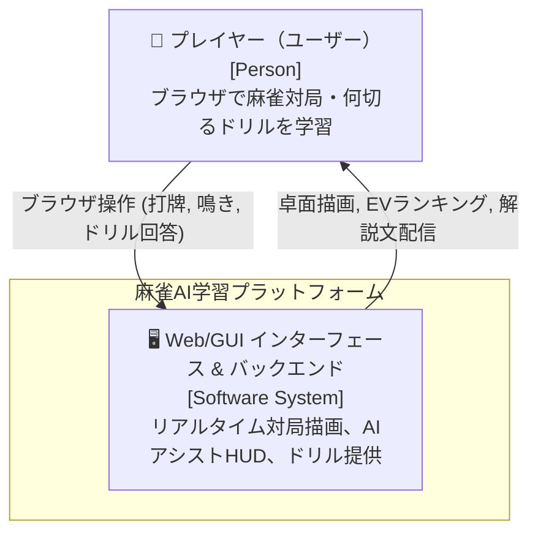
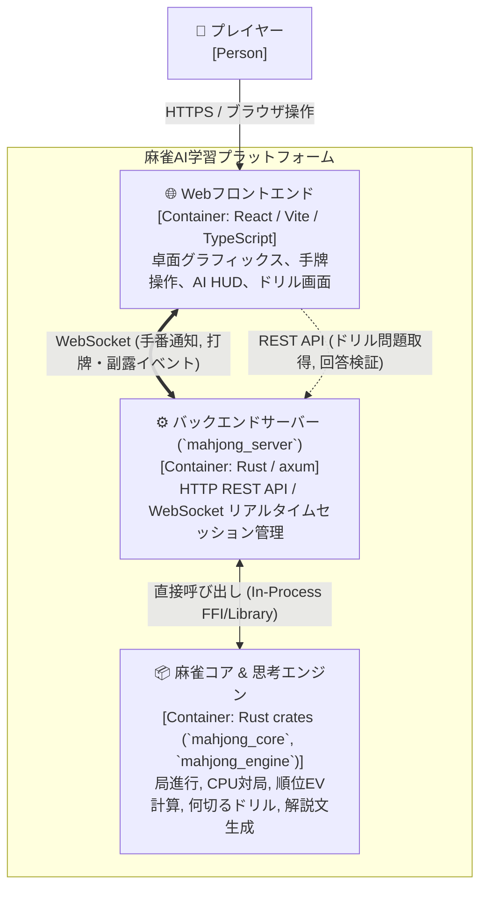
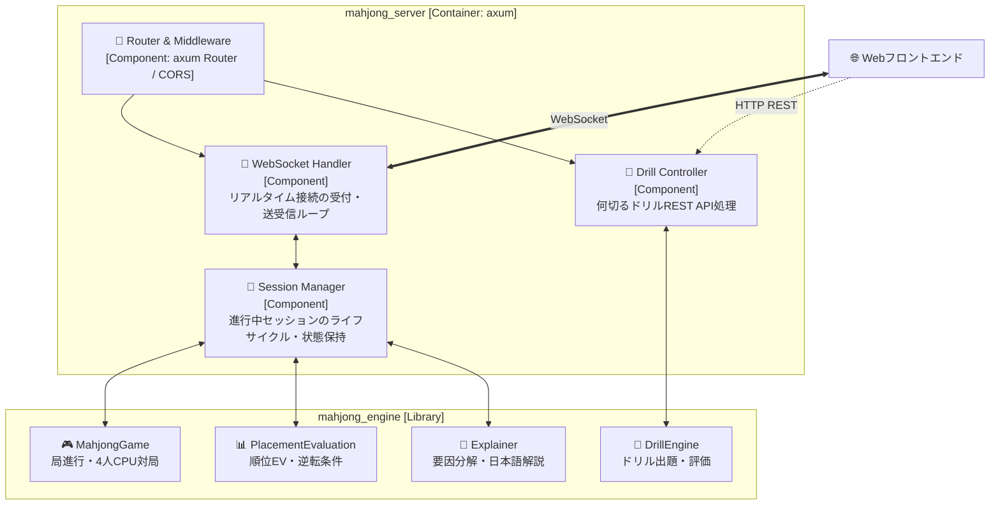
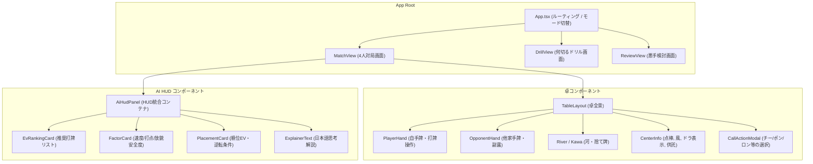
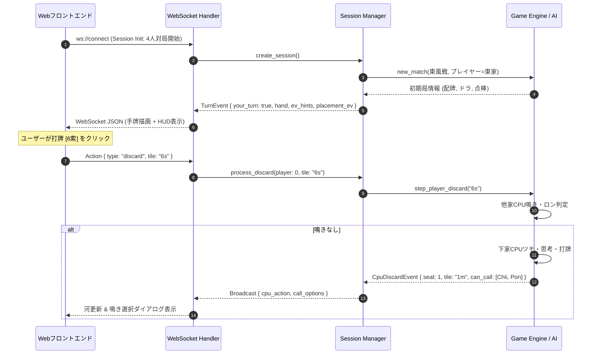

# 設計書：Web / GUI インターフェース

> C4モデル（Context / Container / Component）準拠  
> 本設計書は、参照専用の `definition/templates/design.md` のテンプレートに基づき作成されています。

---

## メタ情報

| 項目 | 値 |
|------|-----|
| プロジェクト名 | mahjong-learning-assistant |
| モジュール名 | web-gui-interface (麻雀AI Web/GUI インターフェース) |
| バージョン | 1.0.0 |
| 作成日 | 2026-09-14 |
| 最終更新日 | 2026-09-14 |
| 作成者 | Syun & AI Assistant |
| ステータス | Review |

---

## 1. Level 1: システムコンテキスト図（Context Diagram）

### 1.1 説明
本システムは、プレイヤーがブラウザ上でリアルタイムに麻雀AIとの対局、何切るドリル、悪手検討を行うためのGUI学習プラットフォームです。
ユーザーはWebブラウザを介して操作し、バックエンドのRustサーバーが麻雀エンジンの状態遷移とAI評価値・解説文の高速計算を担当します。

### 1.2 コンテキスト図

### 1.3 外部アクター・外部システム一覧

| 名前 | 種別 | 説明 |
|------|------|------|
| プレイヤー（ユーザー） | Person | 麻雀の打牌判断や点況判断を学ぶ学習者。ブラウザから対局やドリルを操作する。 |

---

## 2. Level 2: コンテナ図（Container Diagram）

### 2.1 コンテナ図

### 2.2 コンテナ一覧

| コンテナ名 | 技術スタック | 責務 | 通信プロトコル |
|-----------|------------|------|--------------|
| Webフロントエンド | React 18, TypeScript, Vite, Tailwind CSS | 卓ビュー描画、牌操作、AI HUDパネル表示、ドリルUI | HTTP / WebSocket |
| バックエンドサーバー | Rust, `axum`, `tokio`, `serde`, `tower-http` | RESTエンドポイント、WebSocket接続維持、セッション管理 | HTTP / WebSocket (JSON) |
| 麻雀コア & 思考エンジン | Rust (`mahjong_core`, `mahjong_engine`) | 牌理、和了判定、CPU思考、順位EV、何切るドリル、解説文生成 | In-process 関数呼び出し |

### 2.3 技術選定の根拠

| 技術 | 選定理由 | 代替案 |
|------|---------|--------|
| Rust (`axum`) | 既存のRustエンジン資産を直接インプロセスで呼び出せ、非同期WebSocket性能が極めて高くオーバーヘッドゼロ | Node.js / Python (IPCやFFIが必要で二重管理のコスト大) |
| React + Vite + TypeScript | 豊富なUIコンポーネントエコシステム、高速HMR、型安全なAPI/WS通信定義 | Vanilla JS (状態管理が煩雑), Vue / Svelte |
| WebSocket (JSON) | 手番通知や他家CPUの打牌アニメーションを低遅延でクライアントへプッシュ可能 | Server-Sent Events (単方向のみ), Polling (非効率) |

---

## 3. Level 3: コンポーネント図（Component Diagram）

### 3.1 バックエンドサーバー (`mahjong_server`) のコンポーネント図

### 3.2 フロントエンド (`web/src`) のコンポーネント構成

---

## 4. 通信シーケンス設計

### 4.1 対局中の打牌・AIアドバイス・CPU反応シーケンス

---

## 5. API / WebSocket メッセージ仕様

### 5.1 REST API
- `GET /api/health`: サーバー稼働確認
- `GET /api/drill/question?category=all`: 何切る問題取得
- `POST /api/drill/answer`: ユーザー回答送信
  - リクエスト: `{ "question_id": 1, "selected_tile": "5m" }`
  - レスポンス: `{ "correct": true, "best_tile": "5m", "ev_difference": 0.0, "explanation": "..." }`

### 5.2 WebSocket メッセージ形式 (クライアント $\leftrightarrow$ サーバー)

- **サーバー $\to$ クライアント (`ServerMessage`)**:
  - `MatchState`: 局、本場、供託、各家持ち点、ドラ表示牌、残り牌数
  - `YourTurn`: 手牌一覧、ツモ牌、合法打牌一覧、リーチ可否、AI推奨打牌ランキング（EV・受入・解説）、順位EV
  - `ActionRequired`: 鳴き（チー／ポン／カン／ロン）の選択要求、候補面子一覧、パス
  - `OpponentAction`: 他家のアクション（打牌、リーチ、副露面子晒し）
  - `RoundEnd`: 和了・流局結果、点数移動、満貫等役一覧、悪手レビューサマリー

- **クライアント $\to$ サーバー (`ClientMessage`)**:
  - `StartMatch`: 対局開始（ルール設定: Mリーグ/標準）
  - `Discard`: 打牌選択 `{ "tile": "6s", "riichi": false }`
  - `CallAction`: 副露選択 `{ "call_type": "Chii", "consumed": ["7s", "8s"] }` または `{ "call_type": "Pass" }`
  - `NextRound`: 次局へ進む

---

## 6. 変更履歴

| バージョン | 日付 | 変更内容 | 変更者 |
|-----------|------|---------|--------|
| 1.0.0 | 2026-09-14 | 初版作成（C4モデル準拠 Web/GUI インターフェース設計書） | Syun & AI Assistant |
