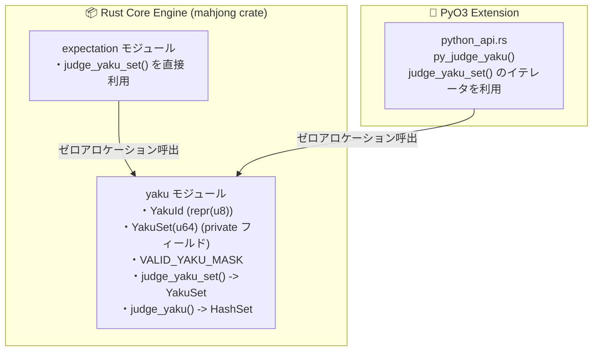

# 設計書: 役判定結果の u64 ビットマスク化 (YakuSet) による高速化

> C4モデル（Context / Container / Component）に準拠した設計書です。  
> GitHub Issue: #89「perf: yaku.rs の HashSet<YakuId> を u64 ビットマスクに置き換える」に対応します。

---

## メタ情報

| 項目 | 値 |
|------|-----|
| プロジェクト名 | mahjong |
| 機能名 | YakuSet による役判定結果の u64 ビットマスク化 |
| バージョン | 1.1.0 |
| 作成日 | 2026-09-15 |
| 最終更新日 | 2026-09-15 |
| 作成者 | Antigravity AI |

---

## 1. Level 1: システムコンテキスト図（Context Diagram）

### 1.1 コンテキスト図

```mermaid
graph TB
    User["👤 麻雀AI / 外部利用者<br/>[Person]<br/>Rust API または Python バインディングを利用"]
    
    subgraph System ["🖥️ 麻雀AIエンジン (mahjong)"]
        Evaluation["打牌評価・期待値計算<br/>[expectation.rs]"]
        JudgeSet["judge_yaku_set()<br/>高速・ゼロアロケーション"]
        JudgeLegacy["judge_yaku()<br/>後方互換ラッパー"]
        YakuSetType["YakuSet (カプセル化 u64)<br/>有効41ビット不変条件保証"]
    end

    User -->|高速判定リクエスト| JudgeSet
    User -->|既存コード / 型注釈| JudgeLegacy
    Evaluation -->|ホットパス呼出| JudgeSet
    JudgeLegacy -->|内部委譲 + HashSet化| JudgeSet
    JudgeSet -->|O(1) 役登録・役満抽出| YakuSetType
```

---

## 2. Level 2: コンテナ図（Container Diagram）



---

## 3. Level 3: コンポーネント図（Component Diagram）

### 3.1 詳細アーキテクチャ

#### 3.1.1 YakuSet データ構造とカプセル化

```rust
pub const VALID_YAKU_MASK: u64 = (1u64 << 41) - 1;

#[derive(Clone, Copy, PartialEq, Eq, Hash, Default)]
pub struct YakuSet(u64); // 内部フィールドは private

impl YakuSet {
    #[inline]
    pub const fn empty() -> Self {
        Self(0)
    }

    /// 有効な41ビットの範囲外のビットを自動的にマスクして構築します。
    #[inline]
    pub const fn from_raw(bits: u64) -> Self {
        Self(bits & VALID_YAKU_MASK)
    }

    /// 有効な41ビットの範囲外のビットが含まれる場合は None を返します。
    #[inline]
    pub const fn from_raw_checked(bits: u64) -> Option<Self> {
        if (bits & !VALID_YAKU_MASK) == 0 {
            Some(Self(bits))
        } else {
            None
        }
    }

    #[inline]
    pub const fn as_raw(&self) -> u64 {
        self.0
    }
}
```

この設計により：
- `from_raw(1 << 63)` 等の不正な上位ビットが混入することを完全に防ぎます。
- `len()` と `ExactSizeIterator`（`YakuSetIter`）の返す要素数が常に 100% 一致します。
- `Debug` 出力と `is_empty` の挙動に一切の不整合が生じません。

#### 3.1.2 役判定公開 API の二重化と後方互換性

```rust
/// ホットパス向けのゼロアロケーション役判定API
pub fn judge_yaku_set(
    closed_counts: &[u8; 35],
    open_melds_input: &[crate::hand::Meld],
    mut ctx: WinContext,
) -> YakuSet {
    // 役判定ロジック（ヒープ割り当てゼロ）
}

/// 既存の後方互換性を維持するための公開ラッパーAPI
pub fn judge_yaku(
    closed_counts: &[u8; 35],
    open_melds_input: &[crate::hand::Meld],
    ctx: WinContext,
) -> HashSet<YakuId> {
    judge_yaku_set(closed_counts, open_melds_input, ctx)
        .into_iter()
        .collect()
}
```

- `src/lib.rs` から `judge_yaku` と `judge_yaku_set` の両方を再エクスポートします。
- 既存の外部利用者は引き続き `judge_yaku(...) -> HashSet<YakuId>` をシームレスに利用可能です。
- パフォーマンスが重視されるエンジン内部（`expectation.rs`）や Python バインディングでは `judge_yaku_set` を呼び出します。
