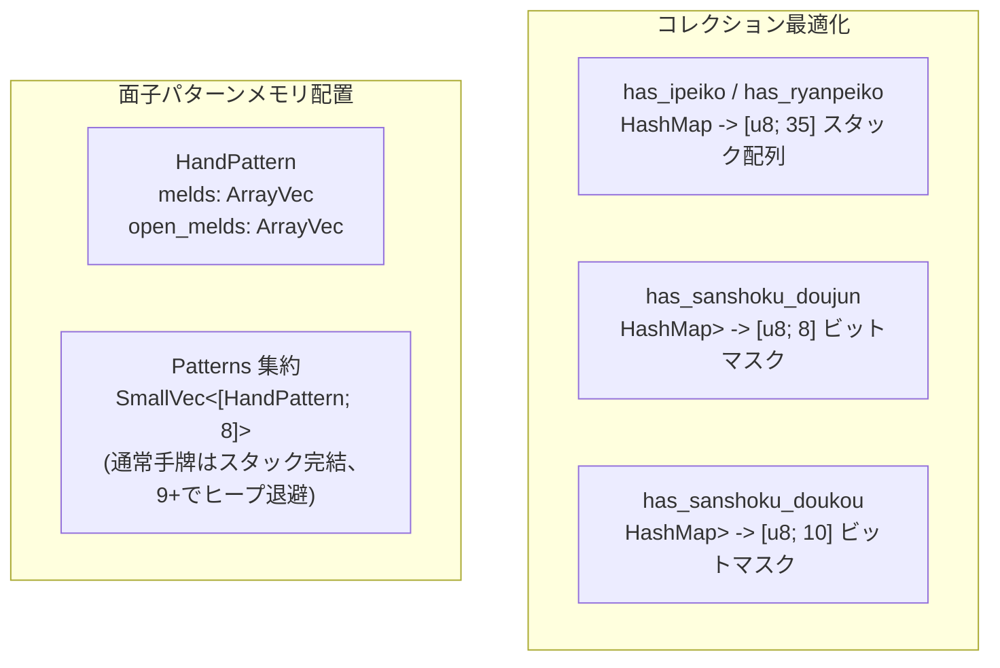

# 基本・詳細設計書: 役判定ゼロアロケーション化 & HashMap 排除

> GitHub Issue: #105「perf(yaku): 役判定におけるヒープアロケーション & HashMap の排除（ゼロアロケーション化）」に対応する設計書です。

---

## 1. アーキテクチャ概要

役判定（`judge_yaku_set`）において、毎判定ごとに発生していたヒープアロケーション（`HashMap`, `HashSet`, `Vec`）をすべてスタック完結型（スタック配列 / `ArrayVec` / `SmallVec`）に置き換えます。

### 1.1 改善アプローチ



---

## 2. 詳細設計

### 2.1 三色判定のビットマスク化

#### 三色同順 (`has_sanshoku_doujun`)
- 順子の開始ランクは 1..=7、スーツは 0 (萬), 1 (筒), 2 (索)。
- スタック上に `suit_masks: [u8; 8]` を配置。
- 各順子に対して `suit_masks[rank] |= 1 << suit` と記録。
- 同一スーツで同じ順子が重複しても、同一ビットへの OR になるため集合（`HashSet`）と等価。
- 判定: `suit_masks[1..=7].iter().any(|&m| (m & 0b111) == 0b111)`。

#### 三色同刻 (`has_sanshoku_doukou`)
- 刻子・槓子のランクは 1..=9。
- スタック上に `suit_masks: [u8; 10]` を配置。
- 各刻子/槓子に対して `suit_masks[rank] |= 1 << suit` と記録。
- 判定: `suit_masks[1..=9].iter().any(|&m| (m & 0b111) == 0b111)`。

### 2.2 一盃口・二盃口のスタック配列化

- 順子の開始牌 `tile`（1..=34）をキーとするカウント配列 `seq_counts: [u8; 35]` をスタックに確保。
- 一盃口: `seq_counts.iter().any(|&c| c >= 2)`
- 二盃口: 全面子が順子である前提のもと、`seq_counts.iter().map(|&c| c / 2).sum::<u8>() >= 2`

### 2.3 `HandPattern` のスタック構造化

```rust
#[derive(Debug, Clone, Copy, PartialEq, Eq)]
pub struct HandPattern {
    pub pair: TileName,
    pub melds: ArrayVec<MeldKind, 4>,
    pub open_melds: ArrayVec<MeldKind, 4>,
}
```
- 面子の個数は麻雀の手牌ルール上、最大4組に確定しているため、容量4の `ArrayVec` で100%収まる。
- パターン配列は `SmallVec<[HandPattern; 8]>` を使用し、通常手牌（1〜4パターン程度）ではヒープアロケーション回数ゼロを達成。あふれた場合でも panic せず安全にヒープへ退避する。

---

## 3. ベンチマーク設計

- 既存の `bench_yaku` に加え、`judge_yaku_set` を直接計測する `bench_yaku_set` を追加。
- 公開互換ラッパー `judge_yaku`（`HashSet` 変換含む）と、エンジン内部の `judge_yaku_set` の両方を分離して計測。
