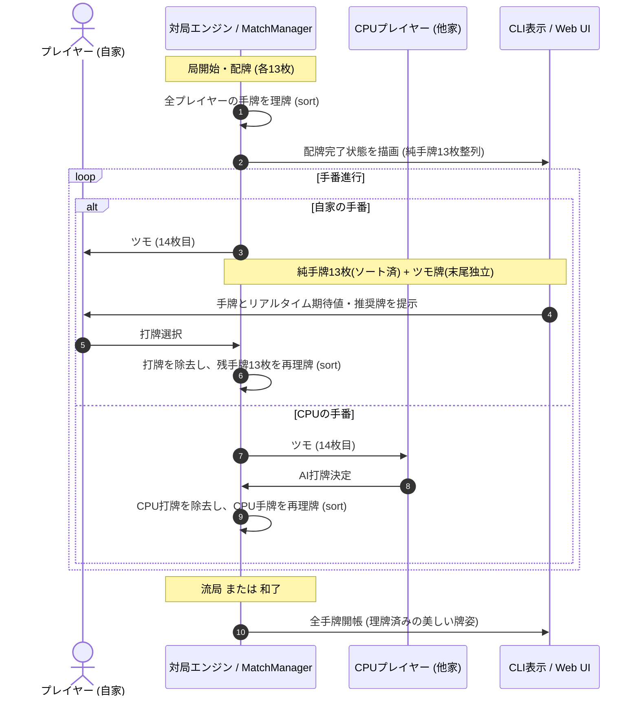

# 要件定義書：コンピュータ対局（CPU対局）手牌の理牌（ソート）

> ISO/IEC/IEEE 29148 準拠（SRS簡易版）  
> 本要件定義書は、参照専用の definition/templates/requirements.md に基づき作成されています。

---

## メタ情報

| 項目 | 値 |
|------|-----|
| プロジェクト名 | mahjong-cpu-match-hand-sorting |
| バージョン | 1.0.0 |
| 作成日 | 2026-09-14 |
| 最終更新日 | 2026-09-14 |
| 作成者 | Syun & AI Assistant |
| ステータス | Approved |

---

## 1. 目的・スコープ

### 1.1 目的
何切るドリル（DrillEngine）の手牌ソート機能に続き、4人コンピュータ対局（CPU対局）モードにおいてもプレイヤーおよびCPUの手牌を萬子・筒子・索子・字牌の順に昇順整列（理牌: リーパイ）する。  
対局中のツモ番時には純手牌（13枚）を整列した上でツモ牌を末尾に独立表示し、打牌後には残った手牌を再整列することで、CLIおよびWeb UI双方において実戦麻雀同様の自然で視認性の高い手牌表示と優れたプレイアビリティを提供する。

### 1.2 スコープ

**スコープ内:**
- **CLI 対局モード (`play_with_cpu.rs`)**:
  - 配牌完了時の全プレイヤー（自家およびCPU 1〜3）の手牌整列（`hand.sort()`）。
  - 自家ツモ時の純手牌（ソート済み）とツモ牌（末尾）の分離表示。
  - 打牌完了時の残手牌の自動再整列。
  - 鳴き（副露）完了後の手牌整列状態維持。
  - 流局時・終局時の手牌開帳（テンパイ・ノーテン手牌）における整列表示。
- **Web UI バックエンド (`match_manager.py`)**:
  - `_sort_hand(player_idx)` のソート実行不備（`sort(key=...)` 呼び出し漏れ）の修正。
  - 配牌時における全手牌の理牌。
  - 人間プレイヤーの打牌後における純手牌の理牌。
  - ツモ時における末尾ツモ牌配置とフロントエンド（`isLastDrawn`）との連携保証。
  - CPUの打牌完了後における手牌理牌。
  - 終局時（和了・流局）の公開手牌における理牌保証。
- **コアライブラリ (`round.rs`)**:
  - `Round::sort_hand(player_index)` メソッドの提供による任意プレイヤーの手牌理牌。
  - 単体テストの追加。

**スコープ外:**
- 手出し・ツモ切りの対局相手からの看破演出（将来的なUI演出拡張としてスコープ外）。
- 牌の並び順の任意カスタマイズ（萬子・筒子・索子・字牌の標準昇順のみをサポート）。

### 1.3 ステークホルダー

| 役割 | 担当者 | 関与度 |
|------|--------|--------|
| プロジェクトオーナー / プレイヤー | ユーザー | 高 |
| 設計・実装 | AI Assistant | 高 |

---

## 2. 用語定義

| 用語 | 定義 |
|------|------|
| **理牌（リーパイ）** | バラバラの手牌を萬子・筒子・索子・字牌の昇順に並べ替えること。 |
| **純手牌** | 手番中にツモ牌を除いた、打牌待ちのベース手牌（通常13枚、1副露で10枚、2副露で7枚、3副露で4枚、4副露で1枚）。 |
| **ツモ牌** | 自分のツモ番で山から引いてきた14枚目（または副露数に応じた最新の1枚）の牌。 |
| **TableState** | Web UIバックエンドとフロントエンド間で卓状態を同期するデータモデル。 |

---

## 3. 全体要件

### 3.1 業務・利用フロー

---

## 4. 機能要件 (Functional Requirements)

### 4.1 配牌時の全プレイヤー手牌理牌
- [x] 配牌時（13枚配布完了時）、自家およびCPU1〜3の全プレイヤーの手牌が昇順（1m〜9m, 1p〜9p, 1s〜9s, 東南西北白發中）に整列されていること。

### 4.2 ツモ時の純手牌整列とツモ牌分離表示
- [x] 手番プレイヤーのツモ時、純手牌はソート状態を維持し、ツモ牌は手牌配列の末尾に配置されること。
- [x] CLI (`play_with_cpu.rs`) では `あなたの手牌: [1:1m] ... [13:9s]  ツモ: [14:5p]` のようにツモ牌が末尾に独立表示されること。
- [x] Web UI (`TableLayout.tsx`) では末尾の牌が `isLastDrawn` によりスペース（`ml-4`）を空けて表示されること。

### 4.3 打牌後の残手牌再理牌
- [x] 手番プレイヤーが打牌を行った直後、残った手牌が昇順に再理牌されること。
- [x] 手出し・ツモ切りのいずれであっても、打牌後は残存手牌が整列状態となること。

### 4.4 終局時の手牌開帳理牌
- [x] 流局時および和了時、開帳される手牌（テンパイ手牌、和了手牌）が理牌された状態で表示されること。

---

## 5. 非機能要件 (Non-Functional Requirements)

### 5.1 性能
- 手牌ソート処理には `Hand::sort()`（Rust: `slice::sort_unstable()`、Python: `list.sort(key=...)`）を使用し、オーバーヘッドを極小（マイクロ秒未満）に抑えること。

### 5.2 互換性
- 既存の打牌候補評価（`evaluate_hand_discards` / `evaluate_placement_discards`）、和了判定、向聴数計算への副作用を与えないこと。
