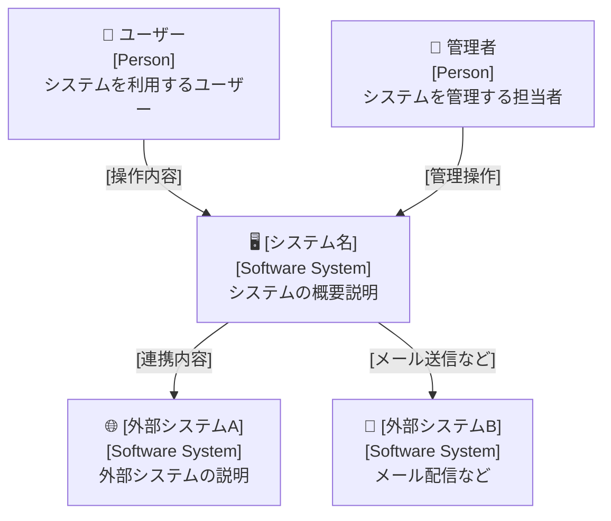
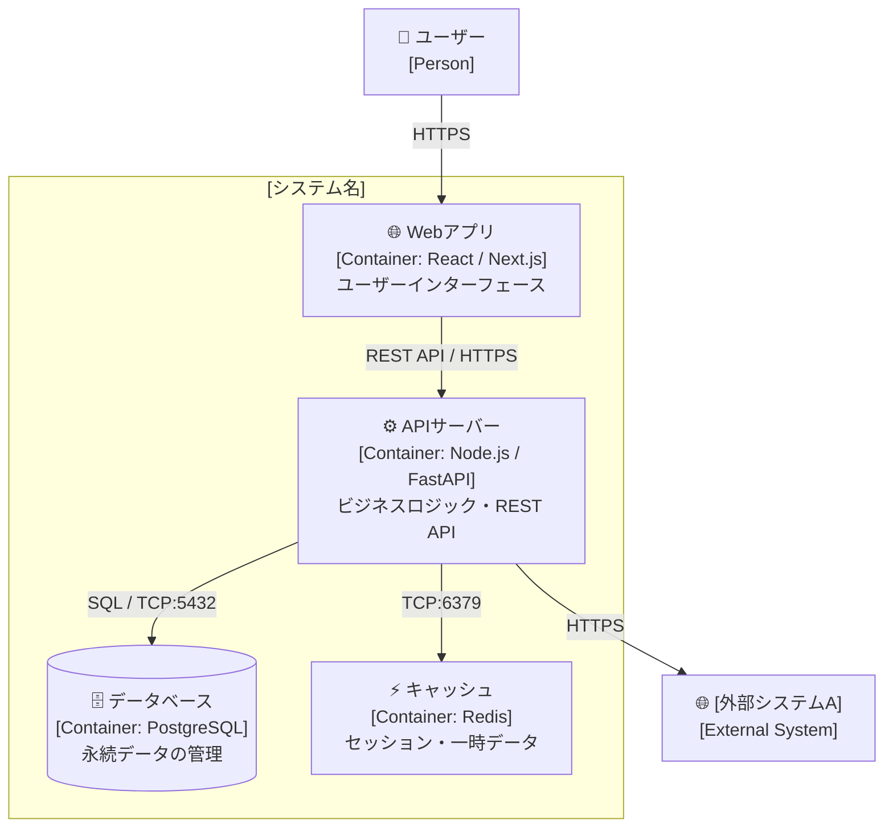
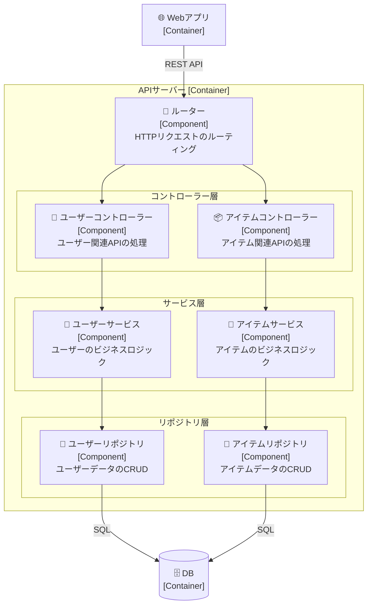
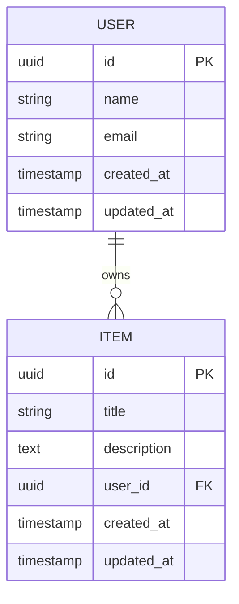
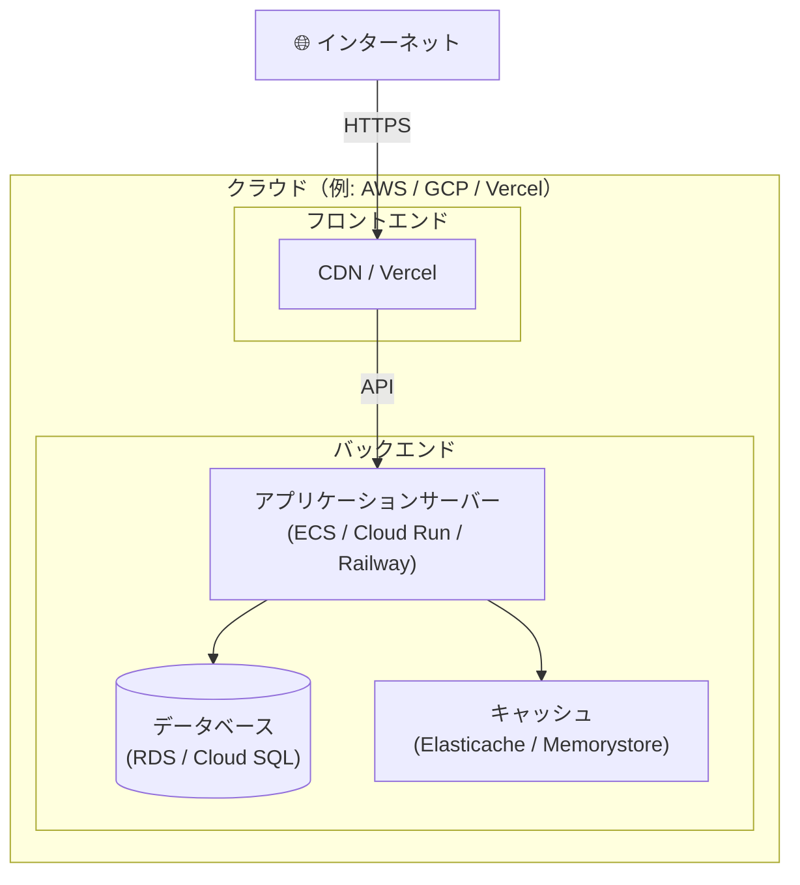

# 設計書テンプレート（C4モデル準拠）

> C4モデル（Context / Container / Component）に準拠した設計書テンプレートです。  
> 図はMermaidでMarkdown内に直接埋め込みます。Level 4（Code）は対象外です。

---

## メタ情報

| 項目 | 値 |
|------|-----|
| プロジェクト名 | [プロジェクト名] |
| バージョン | 1.0.0 |
| 作成日 | YYYY-MM-DD |
| 最終更新日 | YYYY-MM-DD |
| 作成者 | [氏名] |

---

## 1. Level 1: システムコンテキスト図（Context Diagram）

> システム全体像。外部アクター・外部システムとの関係を示す。  
> 誰がこのシステムを使うのか、どの外部システムと連携するのかを一目で把握できるようにする。

### 1.1 説明

[このシステムの概要を記述する。何をするシステムで、誰が使い、何と連携するかを説明する。]

### 1.2 コンテキスト図

### 1.3 外部アクター・外部システム一覧

| 名前 | 種別 | 説明 |
|------|------|------|
| ユーザー | Person | [説明] |
| 管理者 | Person | [説明] |
| [外部システムA] | External System | [説明] |
| [外部システムB] | External System | [説明] |

---

## 2. Level 2: コンテナ図（Container Diagram）

> 実行/デプロイ単位（Webアプリ、APIサーバー、DB等）の構造と技術選定を示す。  
> それぞれのコンテナがどんな責務を持ち、どう通信するかを明確にする。

### 2.1 コンテナ図

### 2.2 コンテナ一覧

| コンテナ名 | 技術スタック | 責務 | 通信プロトコル |
|-----------|------------|------|--------------|
| Webアプリ | React / Next.js | ユーザーインターフェース | HTTPS |
| APIサーバー | Node.js / FastAPI | ビジネスロジック | REST / HTTPS |
| データベース | PostgreSQL | 永続データ管理 | SQL / TCP |
| キャッシュ | Redis | セッション管理 | TCP |

### 2.3 技術選定の根拠

| 技術 | 選定理由 | 代替案 |
|------|---------|--------|
| [技術名] | [理由] | [代替案] |
| [技術名] | [理由] | [代替案] |

---

## 3. Level 3: コンポーネント図（Component Diagram）

> 主要コンポーネント（コントローラー / サービス層 / リポジトリ層等）の責務と依存関係を示す。  
> 各コンテナ内部の主要な構成要素を記述する。

### 3.1 APIサーバーのコンポーネント図（例）

### 3.2 コンポーネント一覧

| コンポーネント名 | 所属コンテナ | 責務 | インターフェース |
|---------------|-----------|------|---------------|
| ルーター | APIサーバー | HTTPリクエストのルーティング | HTTP |
| ユーザーコントローラー | APIサーバー | ユーザー関連API処理 | REST |
| ユーザーサービス | APIサーバー | ユーザーのビジネスロジック | メソッド呼び出し |
| ユーザーリポジトリ | APIサーバー | ユーザーデータのCRUD | SQL |

---

## 4. データモデル（ER図）

> 主要エンティティとその関係を示す。

---

## 5. API設計（主要エンドポイント）

| メソッド | パス | 説明 | リクエスト | レスポンス |
|---------|------|------|----------|----------|
| GET | `/api/v1/users` | ユーザー一覧取得 | - | `User[]` |
| POST | `/api/v1/users` | ユーザー作成 | `CreateUserDto` | `User` |
| GET | `/api/v1/users/:id` | ユーザー取得 | - | `User` |
| PUT | `/api/v1/users/:id` | ユーザー更新 | `UpdateUserDto` | `User` |
| DELETE | `/api/v1/users/:id` | ユーザー削除 | - | `204 No Content` |

---

## 6. インフラ構成

---

## 7. セキュリティ考慮事項

| 観点 | 対策 |
|------|------|
| 認証 | [JWT / セッション / OAuth等の認証方式] |
| 認可 | [RBAC / ABAC等のアクセス制御] |
| 通信 | [HTTPS必須、証明書管理] |
| データ保護 | [暗号化方針、個人情報の取り扱い] |
| 脆弱性対策 | [OWASP Top 10への対応方針] |

---

## 8. 変更履歴

| バージョン | 日付 | 変更内容 | 変更者 |
|-----------|------|---------|--------|
| 1.0.0 | YYYY-MM-DD | 初版作成 | [氏名] |
